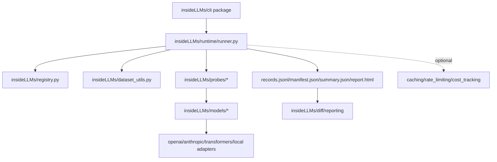

# AGENTS.md
This file provides guidance to Verdent when working with code in this repository.

## Table of Contents
1. Commonly Used Commands
2. High-Level Architecture & Structure
3. Key Rules & Constraints
4. Development Hints

## Commands
- Build/install (editable, full dev extras): `pip install -e ".[dev,nlp,visualization]"`
- Lint: `make lint` (Ruff: `ruff check .`)
- Format check: `make format-check` (Ruff formatter: `ruff format --check .`)
- Typecheck: `make typecheck` (Mypy: `mypy insideLLMs`)
- Test: `make test` (Pytest)
- Run single test: `pytest tests/test_runner.py -k test_<name>`
- Fast tests (skip slow + integration): `make test-fast` (Pytest marker filter)
- Determinism golden path (offline, diff-gating): `make golden-path`
- CLI dev entrypoint (module): `python -m insideLLMs.cli <subcommand> ...`

## Architecture
- Major subsystems & responsibilities
  - `insideLLMs/cli/__init__.py` + `insideLLMs/cli/commands/*`: CLI entrypoint (`insidellms` script) and subcommands (`run`, `harness`, `report`, `diff`, `schema`, `doctor`, etc.).
  - `insideLLMs/runtime/runner.py`: canonical execution engine (`ProbeRunner`, `AsyncProbeRunner`) and config-driven run/harness orchestration.
  - `insideLLMs/registry.py` + registries: model/probe/dataset registration + lookup used by config-driven flows.
  - `insideLLMs/schemas/` + `insideLLMs/trace_contracts.py`: versioned output schemas + validation utilities (used by `schema validate` and optional runtime validation).
  - `insideLLMs/results.py`, `insideLLMs/export.py`, `insideLLMs/visualization.py`: aggregation + report generation (`summary.json`, `report.html`, exports).
  - `insideLLMs/caching.py`, `insideLLMs/rate_limiting.py`, `insideLLMs/cost_tracking.py`: infra modules used by model adapters / pipelines (not all enforced by runner).
  - `insideLLMs/models/` and `insideLLMs/probes/`: provider adapters + probe implementations.
- Key data flows and request/response lifecycles
  - Deterministic spine: config → runner/harness → `records.jsonl` (canonical) → `summary.json`/`report.html` → `diff.json` (CI-friendly surface).
  - Programmatic API mirrors CLI: instantiate Model + Probe → `ProbeRunner.run(...)` / `AsyncProbeRunner.run(...)` → results/ExperimentResult.
- External dependencies
  - Model provider SDKs: `openai`, `anthropic`, `transformers`/`huggingface-hub` (plus local backends via adapters).
  - Config/serialization: `pyyaml` (YAML configs and manifests).
  - Optional extras: NLP (`nltk`, `spacy`, `scikit-learn`, `gensim`), visualization (`matplotlib`, `pandas`, `seaborn`). [inferred from `pyproject.toml`]
- Development entry points
  - CLI: `insideLLMs.cli:main` (`insidellms`)
  - Runner (canonical): `insideLLMs.runtime.runner`
- Mermaid diagram of subsystem relationships
  - (Simplified from `ARCHITECTURE.md`)

## Key Rules & Constraints
- From CLAUDE.md
  - `CLAUDE.md` is a symlink to this file in this repo. [inferred from repo state]
- From .cursor/rules/ or .cursorrules
  - None present at repo root. [inferred]
- From .github/copilot-instructions.md
  - Not present. [inferred]
- From README.md (summarized, no verbatim copy)
  - Determinism is a hard requirement for the “run → records → report → diff” spine; artifacts are intended to be byte-for-byte identical for the same inputs.
  - Canonical artifacts: `records.jsonl` (canonical stream), `manifest.json`, `config.resolved.yaml`, `summary.json`, `report.html`, `diff.json`.
- Determinism specifics (see `docs/DETERMINISM.md`)
  - Canonical JSON/JSONL is emitted with stable key ordering and separators.
  - Timestamps are derived from `run_id` (not wall-clock).
  - Volatile fields are intentionally omitted/neutralized in canonical artifacts (e.g., `latency_ms` persisted as `null`; `manifest.json:command` persisted as `null`).
  - Local file datasets are content-addressed (`dataset_hash=sha256:<...>`) and included in `run_id`.
- CI constraints (from `.github/workflows/ci.yml`)
  - CI runs Ruff lint + Ruff format check + Mypy on 3.12 and Pytest on 3.10/3.11/3.12.
  - Coverage gating is enforced: `--cov-fail-under=95` for `insideLLMs`.
  - Tests should write run artifacts under `INSIDELLMS_RUN_ROOT` when applicable.

## Development Hints
- Adding a new API endpoint
  - [inferred] Treat this as “adding a new CLI subcommand or public runner entrypoint”.
  - CLI: add subcommand wiring in `insideLLMs/cli/_parsing.py` (`create_parser`) and `insideLLMs/cli/commands/*`, then route into `insideLLMs.runtime.runner` functions/classes.
  - Keep the canonical artifact surface deterministic (ordering, timestamps, stable JSON emission).
- Modifying CI/CD pipeline
  - Work in `.github/workflows/ci.yml`; keep the lint/typecheck/test split consistent with local `Makefile` targets.
  - If adding optional deps to CI, prefer scoping with extras already defined in `pyproject.toml` (`.[dev,nlp,visualization]`).
- Extending subsystems
  - Adding a model provider: implement/update adapter under `insideLLMs/models/` and ensure it registers with `model_registry` (used by config-driven runs).
  - Adding a probe: implement under `insideLLMs/probes/` and register with `probe_registry`; keep probe outputs compatible with versioned schemas when validation is enabled.
  - Changing artifacts/schemas: update `insideLLMs/schemas/` and ensure `insidellms schema validate` remains aligned; treat schema changes as part of the CI diff surface.
