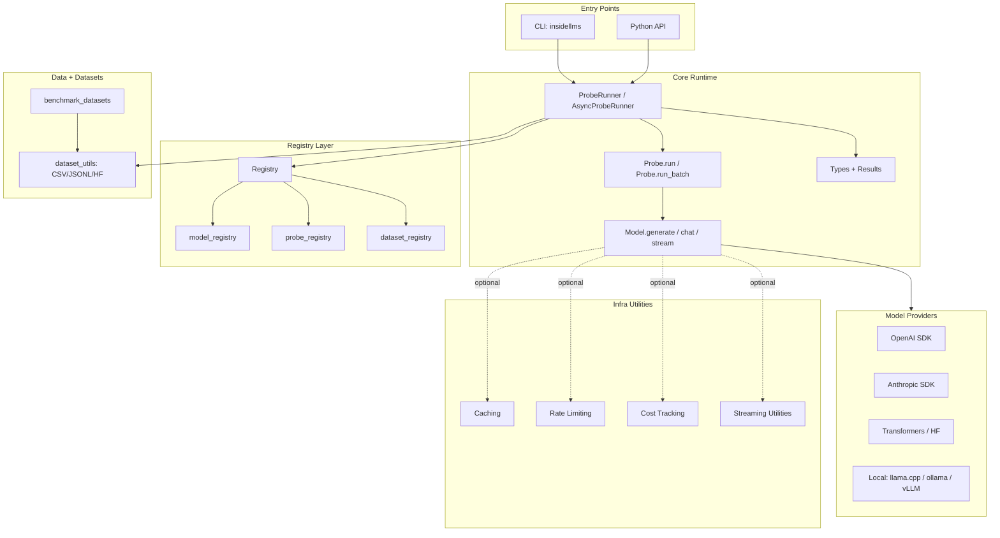
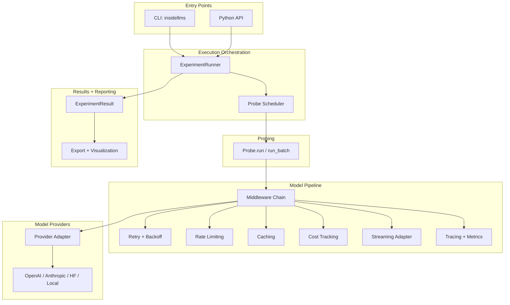
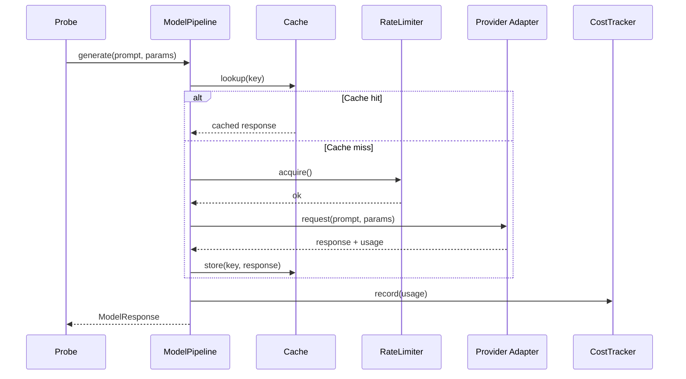
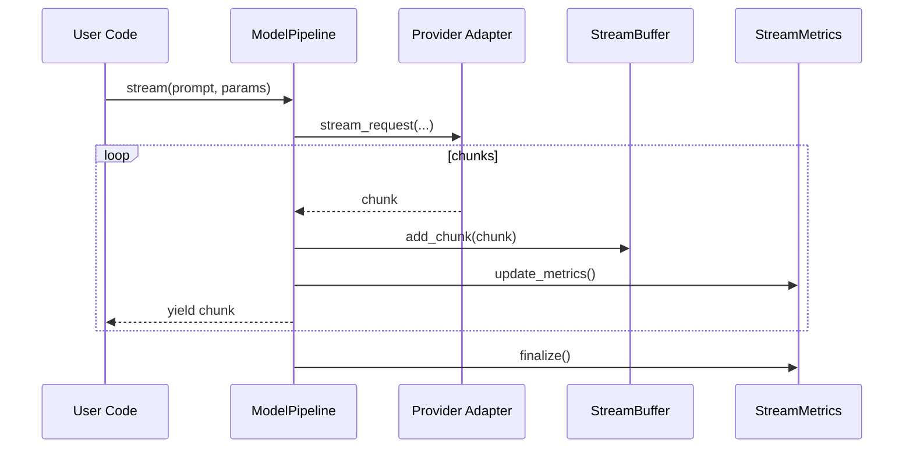
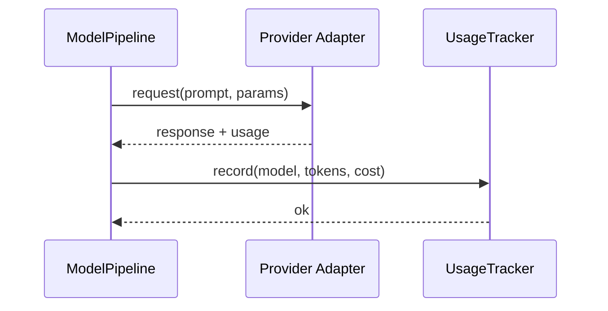
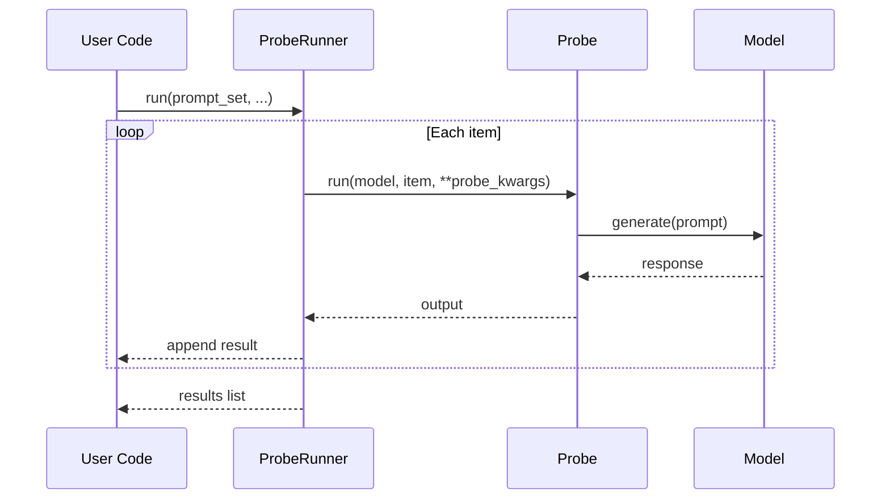
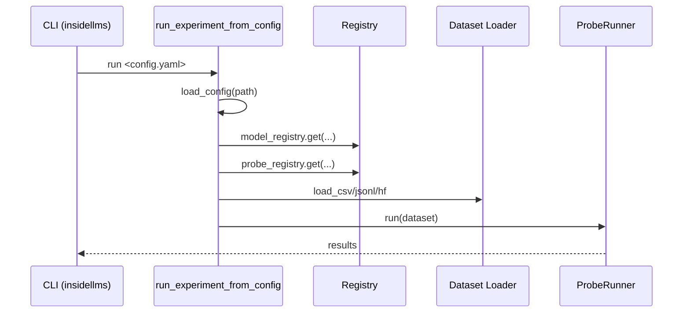
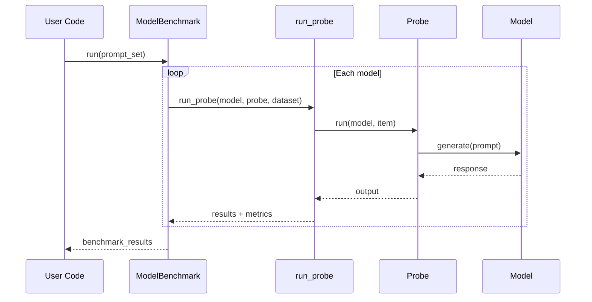

# insideLLMs Architecture

This document describes the current architecture and execution flows in insideLLMs.
It is intended for contributors and advanced users who want to understand how
models, probes, runners, and supporting utilities fit together.

Diagrams are rendered with Mermaid (supported by GitHub Markdown).

## High-Level Architecture



Notes:
- The core flow runs through `ProbeRunner` and `Probe.run` into `Model.generate`.
- Registry and dataset loaders power config-driven and programmatic creation.
- Infra utilities exist as standalone modules and are not currently enforced by the runner.

## Target Architecture (Proposed)

This is a proposed architecture that makes infra capabilities first-class and
standardizes result types across runners and benchmarks.

Key deltas from current:
- Introduce a model pipeline with composable middleware (retry, rate limiting, caching, cost, streaming).
- Standardize all execution to return `ModelResponse` and `ExperimentResult`.
- Make batch and async execution explicit in the runner contract.



## Proposed Model Pipeline Flow



## Model Pipeline API Sketch (Proposed)

This sketch illustrates the intended API shape for composable model middleware.

```python
from insideLLMs.models import OpenAIModel
from insideLLMs.pipeline import (
    ModelPipeline,
    CacheMiddleware,
    RateLimitMiddleware,
    RetryMiddleware,
    CostTrackingMiddleware,
)

base_model = OpenAIModel(model_name="gpt-4o")

pipeline = ModelPipeline(
    base_model,
    middlewares=[
        CacheMiddleware(),
        RateLimitMiddleware(),
        RetryMiddleware(),
        CostTrackingMiddleware(),
    ],
)

response = pipeline.generate("Explain transformers in one paragraph.")
print(response.content)
```

## Proposed Streaming Flow



## Proposed Cost Tracking Flow



## Core Execution Flow (ProbeRunner)



Key behaviour:
- `ProbeRunner` iterates a dataset and calls `Probe.run` per item.
- `Probe.run` is responsible for formatting the prompt and calling the model.
- Results are returned as a list of dictionaries with input/output/error/latency.

## Config-Driven Execution Flow



## Benchmark Flow (ModelBenchmark)



## Supporting Subsystems

- **Registry** (`insideLLMs/registry.py`): Central registration system for models, probes, and dataset loaders.
- **Results & Export** (`insideLLMs/results.py`, `insideLLMs/types.py`): Structured experiment results and export helpers.
- **Infra Utilities** (`insideLLMs/caching_unified.py`, `insideLLMs/rate_limiting.py`, `insideLLMs/cost_tracking.py`, `insideLLMs/streaming.py`): Optional utilities that can be wired into model wrappers.
- **Prompt Tooling** (`insideLLMs/templates.py`, `insideLLMs/prompt_utils.py`, `insideLLMs/template_versioning.py`): Templates and versioning for prompt engineering workflows.

## Extension Points

- **Models**: Implement `Model.generate` (and optional `chat`/`stream`) in `insideLLMs/models/base.py`.
- **Probes**: Implement `Probe.run` (and optionally `run_batch`/`score`) in `insideLLMs/probes/base.py`.
- **Datasets**: Add loaders to `insideLLMs/dataset_utils.py` and register in `insideLLMs/registry.py`.
