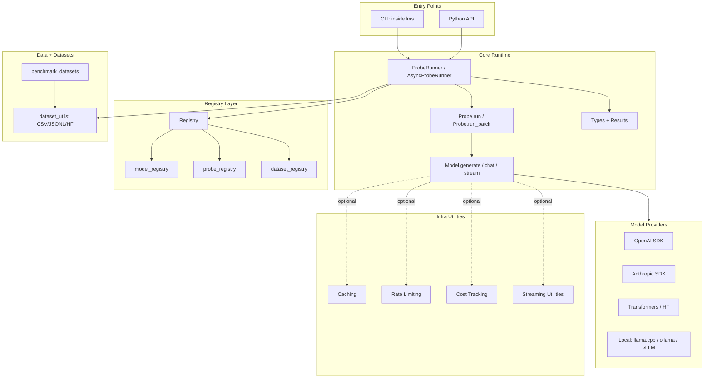
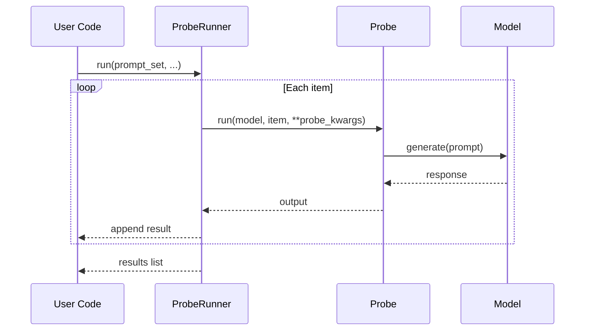
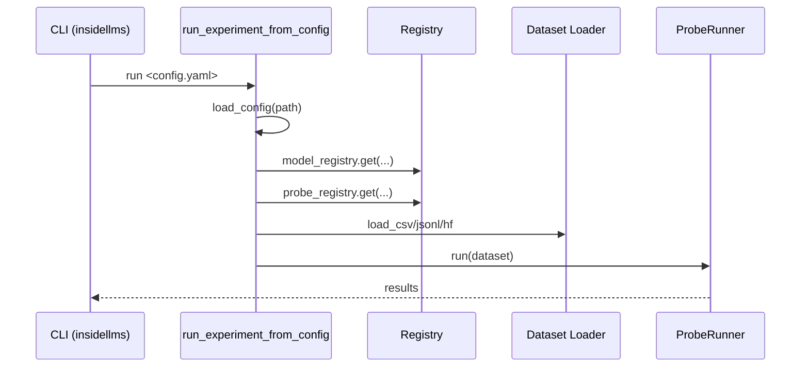
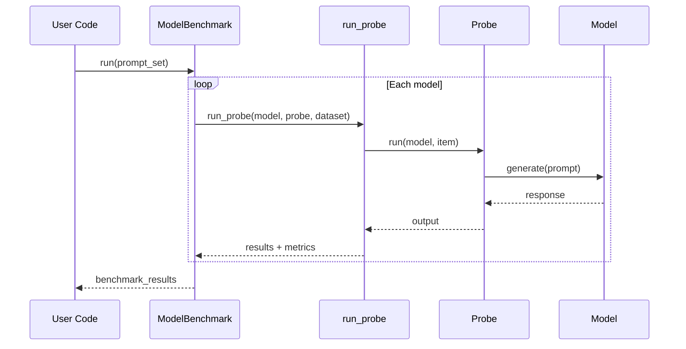

# insideLLMs Architecture

This document describes the current architecture and execution flows in insideLLMs.
It is intended for contributors and advanced users who want to understand how
models, probes, runners, and supporting utilities fit together.

Diagrams are rendered with Mermaid (supported by GitHub Markdown).

## High-Level Architecture


```mermaid
graph TD
  subgraph EntryPoints[Entry Points]
    CLI[CLI: insidellms]
    API[Python API]
  end

  subgraph CoreRuntime[Core Runtime]
    Runner[ProbeRunner / AsyncProbeRunner]
    Probe[Probe.run / Probe.run_batch]
    Model[Model.generate / chat / stream]
    Types[Types + Results]
  end

  subgraph Registries[Registry Layer]
    Registry[Registry]
    ModelReg[model_registry]
    ProbeReg[probe_registry]
    DatasetReg[dataset_registry]
  end

  subgraph DataLayer[Data + Datasets]
    DatasetLoaders[dataset_utils: CSV/JSONL/HF]
    BenchDatasets[benchmark_datasets]
  end

  subgraph Providers[Model Providers]
    OpenAI[OpenAI SDK]
    Anthropic[Anthropic SDK]
    HF[Transformers / HF]
    Local[Local: llama.cpp / ollama / vLLM]
  end

  subgraph Infra[Infra Utilities]
    Cache[Caching]
    RateLimit[Rate Limiting]
    Cost[Cost Tracking]
    Stream[Streaming Utilities]
  end

  CLI --> Runner
  API --> Runner
  Runner --> Probe
  Probe --> Model
  Model --> Providers
  Runner --> Types

  Registry --> ModelReg
  Registry --> ProbeReg
  Registry --> DatasetReg
  Runner --> Registry
  Runner --> DatasetLoaders

  BenchDatasets --> DatasetLoaders

  Model -. optional .-> Cache
  Model -. optional .-> RateLimit
  Model -. optional .-> Cost
  Model -. optional .-> Stream
```

Notes:
- The core flow runs through `ProbeRunner` and `Probe.run` into `Model.generate`.
- Registry and dataset loaders power config-driven and programmatic creation.
- Infra utilities exist as standalone modules and are not currently enforced by the runner.

## Dependency Rules and Architecture Guards

The layer boundaries are executable, not aspirational. `architecture/layers.json`
assigns every `insideLLMs.*` module to a layer and lists the layers each one may
import:

```text
contracts -> contracts only
core      -> contracts + core infrastructure + runtime protocols
runtime   -> contracts + core infrastructure
inference -> contracts + core + runtime protocols
providers -> contracts + core + runtime protocols
evals     -> contracts + core
analysis  -> contracts + core + artifacts/analysis
cli       -> leaf integration layer
labs      -> may consume stable product layers; never the reverse
```

`scripts/architecture_evidence.py` builds the import graph and the root-API
manifest statically (it never imports the package), and `tests/architecture/`
fails on any edge the matrix forbids unless that exact edge is recorded in
`architecture/import_exceptions.json` with an owner, a reason, and an expiry.
Run `make architecture` locally; CI runs the same check. The exception policy
and the regeneration workflow are described in
[docs/ARCHITECTURE_GUARDS.md](docs/ARCHITECTURE_GUARDS.md); the generated
root-facade inventory is [docs/API_STATUS.md](docs/API_STATUS.md).

The composable model middleware that earlier revisions of this document
sketched as a proposal is implemented in `insideLLMs/runtime/pipeline.py`.

## Core Execution Flow (ProbeRunner)


```mermaid
sequenceDiagram
  participant U as User Code
  participant R as ProbeRunner
  participant P as Probe
  participant M as Model

  U->>R: run(prompt_set, ...)
  loop Each item
    R->>P: run(model, item, **probe_kwargs)
    P->>M: generate(prompt)
    M-->>P: response
    P-->>R: output
    R-->>U: append result
  end
  R-->>U: results list
```

Key behaviour:
- `ProbeRunner` iterates a dataset and calls `Probe.run` per item.
- `Probe.run` is responsible for formatting the prompt and calling the model.
- Results are returned as a list of dictionaries with input/output/error/latency.

## Config-Driven Execution Flow


```mermaid
sequenceDiagram
  participant CLI as CLI (insidellms)
  participant Runner as run_experiment_from_config
  participant Registry as Registry
  participant DS as Dataset Loader
  participant PR as ProbeRunner

  CLI->>Runner: run <config.yaml>
  Runner->>Runner: load_config(path)
  Runner->>Registry: model_registry.get(...)
  Runner->>Registry: probe_registry.get(...)
  Runner->>DS: load_csv/jsonl/hf
  Runner->>PR: run(dataset)
  PR-->>CLI: results
```

## Benchmark Flow (ModelBenchmark)


```mermaid
sequenceDiagram
  participant U as User Code
  participant B as ModelBenchmark
  participant R as run_probe
  participant P as Probe
  participant M as Model

  U->>B: run(prompt_set)
  loop Each model
    B->>R: run_probe(model, probe, dataset)
    R->>P: run(model, item)
    P->>M: generate(prompt)
    M-->>P: response
    P-->>R: output
    R-->>B: results + metrics
  end
  B-->>U: benchmark_results
```

## Supporting Subsystems

- **Registry** (`insideLLMs/registry.py`): Central registration system for models, probes, and dataset loaders.
- **Results & Export** (`insideLLMs/results.py`, `insideLLMs/types.py`): Structured experiment results and export helpers.
- **Infra Utilities** (`insideLLMs/caching.py`, `insideLLMs/rate_limiting.py`, `insideLLMs/cost_tracking.py`, `insideLLMs/streaming.py`): Optional utilities that can be wired into model wrappers.
- **Prompt Tooling** (`insideLLMs/contrib/templates.py`, `insideLLMs/contrib/prompt_utils.py`, `insideLLMs/contrib/template_versioning.py`): Templates and versioning for prompt engineering workflows.

## Extension Points

- **Models**: Implement `Model.generate` (and optional `chat`/`stream`) in `insideLLMs/models/base.py`.
- **Probes**: Implement `Probe.run` (and optionally `run_batch`/`score`) in `insideLLMs/probes/base.py`.
- **Datasets**: Add loaders to `insideLLMs/dataset_utils.py` and register in `insideLLMs/registry.py`.
