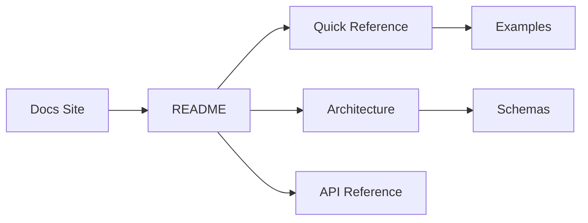

# insideLLMs Documentation Index

Welcome to the insideLLMs documentation. Start with the Docs Site for guides and then use this
index for local references.

[Docs Site](https://dr-gareth-roberts.github.io/insideLLMs/)

---

## Documentation Files

### [ARCHITECTURE.md](ARCHITECTURE.md)
**Architecture and execution flow diagrams** for the core runtime.

**Contents:**
- High-level component map
- ProbeRunner and config execution flows
- Benchmarking flow
- Extension points and supporting subsystems

**Best for:** Understanding how modules interact, onboarding contributors, system-level reasoning

---

### [API_REFERENCE.md](API_REFERENCE.md) (51 KB, 2,123 lines)
**Comprehensive API documentation** covering all public interfaces.

**Contents:**
- **Core Model Classes** - Base `Model` class and implementations (`OpenAIModel`, `AnthropicModel`, `HuggingFaceModel`, `DummyModel`)
- **Core Probe Classes** - Base `Probe` class and implementations (`LogicProbe`, `BiasProbe`, `AttackProbe`, `FactualityProbe`)
- **Runner and Orchestration** - `ProbeRunner`, `AsyncProbeRunner`, `ModelBenchmark`, configuration-based execution
- **Registry System** - `Registry` class and global registries (`model_registry`, `probe_registry`, `dataset_registry`)
- **Dataset Utilities** - Functions for loading CSV, JSONL, and HuggingFace datasets
- **NLP Utilities** - 100+ text processing functions (cleaning, tokenization, similarity, metrics, etc.)
- **Type Definitions** - All data classes and enums used throughout the library

**Best for:** Detailed reference, understanding all parameters and return types, exploring advanced features

---

### [QUICK_REFERENCE.md](QUICK_REFERENCE.md) (6.6 KB)
**Quick reference guide** for the most commonly used APIs.

**Contents:**
- Quick start examples
- Common usage patterns
- Code snippets for frequent tasks
- Configuration examples
- Cheat sheet format

**Best for:** Quick lookups, getting started, common tasks, copy-paste examples

---

### [README.md](README.md)
**Project overview and getting started guide.**

**Contents:**
- Installation instructions
- Feature overview
- Basic usage examples
- Project structure
- Contributing guidelines

**Best for:** First-time users, understanding what the library does, installation

---

### [docs/GOLDEN_PATH.md](docs/GOLDEN_PATH.md)
**A 5-minute offline, end-to-end workflow** (DummyModel → records → report → diff) suitable for CI gating.

**Best for:** First-time users, CI diff-gating setup, verifying installation without API keys

---

### [docs/PLUGINS.md](docs/PLUGINS.md)
**How to extend insideLLMs without forking** using Python entry points.

**Best for:** Third-party integrations, adding private models/probes, sharing extensions

---

### [docs/STABILITY.md](docs/STABILITY.md)
**Versioning and stability policy** for CLI, schemas, and determinism guarantees.

**Best for:** Contributors, CI users, reviewing breaking changes

---

### [docs/STABILITY_MATRIX.md](docs/STABILITY_MATRIX.md)
**Surface-by-surface compatibility contract matrix** (Stable / Experimental / Internal)
for CLI, artifacts, schemas, and extension points.

**Best for:** PR review, release planning, deprecation decisions, contract governance

---

### [wiki/Experiment-Tracking.md](wiki/Experiment-Tracking.md)
**Experiment tracking backends** for logging metrics/params/artifacts (local, W&B, MLflow, TensorBoard).

**Best for:** Logging runs to dashboards, correlating metadata outside deterministic artifacts

---

### [wiki/Performance-and-Caching.md](wiki/Performance-and-Caching.md)
**Performance knobs and caching overview** (async, concurrency, rate limiting, cache layers).

**Best for:** Speeding up runs, reducing cost, understanding caching tradeoffs

---

### [wiki/Tracing-and-Fingerprinting.md](wiki/Tracing-and-Fingerprinting.md)
**Trace-aware diffing and fingerprinting** for CI gating and drift detection.

**Best for:** Understanding `insidellms diff` trace flags and structured-output fingerprints

---

## Quick Navigation

### I want to...

#### **Get started with the library**
→ Start with [README.md](README.md), then [QUICK_REFERENCE.md](QUICK_REFERENCE.md)

#### **Use a specific model (OpenAI, Anthropic, HuggingFace)**
→ [API_REFERENCE.md - Core Model Classes](API_REFERENCE.md#core-model-classes)

#### **Test a model for bias, logic, or security**
→ [API_REFERENCE.md - Core Probe Classes](API_REFERENCE.md#core-probe-classes)

#### **Run benchmarks comparing multiple models**
→ [API_REFERENCE.md - ModelBenchmark](API_REFERENCE.md#modelbenchmark)

#### **Process text (clean, tokenize, analyze)**
→ [API_REFERENCE.md - NLP Utilities](API_REFERENCE.md#nlp-utilities)

#### **Load datasets from files**
→ [API_REFERENCE.md - Dataset Utilities](API_REFERENCE.md#dataset-utilities)

#### **Run experiments from configuration files**
→ [API_REFERENCE.md - Configuration-Based Execution](API_REFERENCE.md#configuration-based-execution)

#### **Run a cross-model behavioural harness**
→ [README.md](README.md#behavioural-harness), [Docs Site](https://dr-gareth-roberts.github.io/insideLLMs/)

#### **Track runs in W&B / MLflow / TensorBoard**
→ [wiki/Experiment-Tracking.md](wiki/Experiment-Tracking.md)

#### **Speed up runs with caching / concurrency**
→ [wiki/Performance-and-Caching.md](wiki/Performance-and-Caching.md)

#### **Use trace-aware diffing**
→ [wiki/Tracing-and-Fingerprinting.md](wiki/Tracing-and-Fingerprinting.md)

#### **Find a quick code example**
→ [QUICK_REFERENCE.md](QUICK_REFERENCE.md)

#### **Understand the architecture and runtime flows**
→ [ARCHITECTURE.md](ARCHITECTURE.md)

#### **Understand the type system**
→ [API_REFERENCE.md - Type Definitions](API_REFERENCE.md#type-definitions)

---

## Documentation by Topic

### Models

| Topic | Document | Section |
|-------|----------|---------|
| Model overview | API_REFERENCE.md | [Core Model Classes](API_REFERENCE.md#core-model-classes) |
| OpenAI models | API_REFERENCE.md | [OpenAIModel](API_REFERENCE.md#openaimodel) |
| Anthropic models | API_REFERENCE.md | [AnthropicModel](API_REFERENCE.md#anthropicmodel) |
| HuggingFace models | API_REFERENCE.md | [HuggingFaceModel](API_REFERENCE.md#huggingfacemodel) |
| Testing models | API_REFERENCE.md | [DummyModel](API_REFERENCE.md#dummymodel) |
| Quick examples | QUICK_REFERENCE.md | [Models](QUICK_REFERENCE.md#models) |

### Probes

| Topic | Document | Section |
|-------|----------|---------|
| Probe overview | API_REFERENCE.md | [Core Probe Classes](API_REFERENCE.md#core-probe-classes) |
| Logic testing | API_REFERENCE.md | [LogicProbe](API_REFERENCE.md#logicprobe) |
| Bias detection | API_REFERENCE.md | [BiasProbe](API_REFERENCE.md#biasprobe) |
| Security testing | API_REFERENCE.md | [AttackProbe](API_REFERENCE.md#attackprobe) |
| Factuality testing | API_REFERENCE.md | [FactualityProbe](API_REFERENCE.md#factualityprobe) |
| Quick examples | QUICK_REFERENCE.md | [Probes](QUICK_REFERENCE.md#probes) |

### Execution

| Topic | Document | Section |
|-------|----------|---------|
| Running probes | API_REFERENCE.md | [ProbeRunner](API_REFERENCE.md#proberunner) |
| Async execution | API_REFERENCE.md | [AsyncProbeRunner](API_REFERENCE.md#asyncproberunner) |
| Benchmarking | API_REFERENCE.md | [ModelBenchmark](API_REFERENCE.md#modelbenchmark) |
| Config files | API_REFERENCE.md | [Configuration-Based Execution](API_REFERENCE.md#configuration-based-execution) |
| Quick examples | QUICK_REFERENCE.md | [Runners](QUICK_REFERENCE.md#runners) |

### Data Management

| Topic | Document | Section |
|-------|----------|---------|
| Registry system | API_REFERENCE.md | [Registry System](API_REFERENCE.md#registry-system) |
| Loading datasets | API_REFERENCE.md | [Dataset Utilities](API_REFERENCE.md#dataset-utilities) |
| Quick examples | QUICK_REFERENCE.md | [Registry](QUICK_REFERENCE.md#registry) |

### NLP Utilities

| Topic | Document | Section |
|-------|----------|---------|
| Text cleaning | API_REFERENCE.md | [Text Cleaning](API_REFERENCE.md#text-cleaning-and-normalization) |
| Tokenization | API_REFERENCE.md | [Tokenization](API_REFERENCE.md#tokenization-and-segmentation) |
| Similarity metrics | API_REFERENCE.md | [Text Similarity](API_REFERENCE.md#text-similarity) |
| Text metrics | API_REFERENCE.md | [Text Metrics](API_REFERENCE.md#text-metrics) |
| Pattern extraction | API_REFERENCE.md | [Pattern Extraction](API_REFERENCE.md#pattern-extraction) |
| Quick examples | QUICK_REFERENCE.md | [NLP Utilities](QUICK_REFERENCE.md#nlp-utilities) |

---

## Common Use Cases

### Use Case 1: Test a model for bias
1. Read [BiasProbe documentation](API_REFERENCE.md#biasprobe)
2. Check [quick example](QUICK_REFERENCE.md#using-probes)
3. See [complete example](API_REFERENCE.md#complete-usage-example)

### Use Case 2: Compare multiple models
1. Read [ModelBenchmark documentation](API_REFERENCE.md#modelbenchmark)
2. Check [benchmarking example](QUICK_REFERENCE.md#benchmarking)
3. See [configuration files](QUICK_REFERENCE.md#configuration-files)

### Use Case 3: Process and analyze text
1. Browse [NLP Utilities](API_REFERENCE.md#nlp-utilities)
2. Check [quick examples](QUICK_REFERENCE.md#nlp-utilities)
3. See `examples/example_nlp.py` for full demo

### Use Case 4: Run experiments from config
1. Read [Configuration-Based Execution](API_REFERENCE.md#configuration-based-execution)
2. Check [config example](QUICK_REFERENCE.md#configuration-files)
3. See `README.md` and `QUICK_REFERENCE.md` for sample configs

### Use Case 5: Run a cross-model behavioural harness
1. Read [README.md](README.md#behavioural-harness)
2. See the runner guide in the [Docs Site](https://dr-gareth-roberts.github.io/insideLLMs/)

---

## Search Tips

- **Looking for a specific function?** Use your editor's search (Cmd/Ctrl+F) in API_REFERENCE.md
- **Need a quick example?** Check QUICK_REFERENCE.md first
- **Want to understand a concept?** Start with the relevant section in API_REFERENCE.md
- **Need installation help?** See README.md

---

## Additional Resources

- **Examples:** See `examples/` directory for runnable code
- **Tests:** See `tests/` directory for usage examples
- **Configuration:** See `README.md` and `QUICK_REFERENCE.md` for sample configurations
- **Source Code:** Browse `insideLLMs/` for implementation details

---

## Contributing

If you find errors or have suggestions for improving the documentation:
1. Open an issue on GitHub
2. Submit a pull request with corrections
3. Contact the maintainers

---

**Last Updated:** January 17, 2026  
**Version:** 0.1.0
