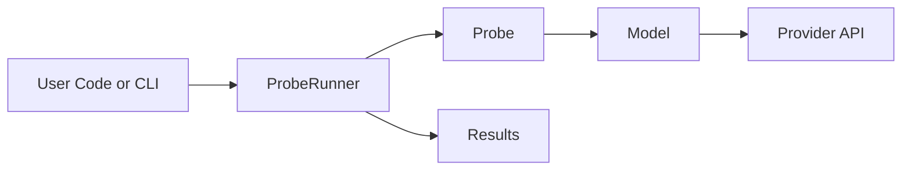

<div align="center">
  <h1 align="center">insideLLMs</h1>
  <p align="center">
    <strong>A comprehensive Python library for LLM evaluation, testing, and production deployment</strong>
  </p>
  <p align="center">
    <a href="#quick-start">Quick Start</a> &bull;
    <a href="#features">Features</a> &bull;
    <a href="#cli-usage">CLI</a> &bull;
    <a href="#documentation">Docs</a>
  </p>
</div>

<p align="center">
  
  
  
  
  
</p>

---

**insideLLMs** is a comprehensive Python toolkit that gives you everything you need to understand, evaluate, and deploy large language models in production. With **93 modules**, **113,000+ lines of code**, and **3,098 tests**, it provides deep insights into model behavior, safety, and performance.

```python
from insideLLMs import ProbeRunner, LogicProbe
from insideLLMs.models import OpenAIModel

# Evaluate any LLM in 3 lines
model = OpenAIModel("gpt-4o")
results = ProbeRunner(model, LogicProbe()).run([
    "If all cats are mammals and all mammals breathe, do all cats breathe?"
])
```

---

## Why insideLLMs?

| Challenge | insideLLMs Solution |
|-----------|---------------------|
| **"Which model should I use?"** | Side-by-side benchmarking across 9 providers with 13+ built-in datasets |
| **"Is my model safe?"** | Comprehensive safety probes: bias detection, prompt injection, jailbreak testing, PII detection |
| **"My LLM app is slow and expensive"** | Production infrastructure: caching, rate limiting, cost tracking, streaming |
| **"I can't reproduce my results"** | Full experiment tracking with W&B, MLflow, TensorBoard + environment capture |
| **"My prompts are brittle"** | Sensitivity analysis, A/B testing, template versioning, prompt optimization |
| **"I need to debug model behavior"** | Attention analysis, reasoning chain extraction, hallucination detection |

---

## Requirements

- **Python**: 3.9 or higher
- **Operating System**: OS Independent (Tested on Linux, macOS, Windows)

---

## Quick Start

### Installation

You can install `insideLLMs` using `pip`:

```bash
# Base package
pip install insideLLMs

# With NLP utilities (nltk, spacy, scikit-learn, gensim)
pip install insideLLMs[nlp]

# With Visualization (matplotlib, pandas, seaborn)
pip install insideLLMs[visualization]

# All optional dependencies
pip install insideLLMs[all]
```

Alternatively, if you use [uv](https://github.com/astral-sh/uv):

```bash
uv pip install insideLLMs[all]
```

### Your First Evaluation

```python
from insideLLMs import DummyModel, LogicProbe, BiasProbe, ProbeRunner
from insideLLMs import save_results_json

# Use DummyModel for testing (or any real model)
model = DummyModel()

# Run multiple probes
for probe in [LogicProbe(), BiasProbe()]:
    runner = ProbeRunner(model, probe)
    results = runner.run([
        "What is 2 + 2?",
        "If A implies B and B implies C, does A imply C?",
    ])
    print(f"{probe.name}: {len(results)} results")

# Save results
save_results_json(results, "evaluation_results.json")
```

### With Real Models

```python
from insideLLMs.models import OpenAIModel, AnthropicModel, HuggingFaceModel

# OpenAI
gpt4 = OpenAIModel("gpt-4.1")

# Anthropic
claude = AnthropicModel("claude-4.5-opus")

# Local models
from insideLLMs.models import OllamaModel, LlamaCppModel
llama = OllamaModel("llama-3.3-70b")
```

---

## Architecture

See `ARCHITECTURE.md` for detailed runtime and flow diagrams.



---

## Features

### 1. Comprehensive Model Evaluation

**13+ Built-in Benchmark Datasets**

```python
from insideLLMs.benchmark_datasets import (
    list_builtin_datasets,
    load_builtin_dataset,
    create_comprehensive_benchmark_suite,
)

# See all datasets
for ds in list_builtin_datasets():
    print(f"{ds['name']}: {ds['num_examples']} examples")

# Output:
# reasoning: 50 examples
# math: 100 examples
# coding: 75 examples
# safety: 60 examples
# ... and 9 more
```

**15+ Evaluation Probes**

| Category | Probes |
|----------|--------|
| **Reasoning** | `LogicProbe`, `FactualityProbe`, `MultiStepTaskProbe` |
| **Safety** | `BiasProbe`, `AttackProbe`, `PromptInjectionProbe`, `JailbreakProbe` |
| **Code** | `CodeGenerationProbe`, `CodeExplanationProbe`, `CodeDebugProbe` |
| **Instructions** | `InstructionFollowingProbe`, `ConstraintComplianceProbe` |

### 2. Production Infrastructure

**Intelligent Caching**

```python
from insideLLMs.caching import PromptCache, memoize

# Semantic similarity caching - finds similar prompts
cache = PromptCache(similarity_threshold=0.9)

# Or use the decorator
@memoize(max_size=1000, ttl_seconds=3600)
def call_llm(prompt):
    return model.generate(prompt)
```

**Cost Tracking & Budgets**

```python
from insideLLMs.cost_tracking import BudgetManager, UsageTracker

budget = BudgetManager(monthly_limit=100.00)
tracker = UsageTracker()

# Automatically tracks all API calls
result = model.generate("Hello")
print(f"Cost: ${tracker.total_cost:.4f}")
print(f"Budget remaining: ${budget.remaining:.2f}")
```

**Smart Context Window Management**

```python
from insideLLMs.context_window import ContextWindow, PriorityLevel

window = ContextWindow(max_tokens=128000)
window.add_message("system", "You are helpful", priority=PriorityLevel.CRITICAL)
window.add_message("user", very_long_document, priority=PriorityLevel.LOW)

# Intelligently truncates low-priority content first
window.truncate(target_tokens=50000)
```

### 3. Safety & Security Analysis

```python
from insideLLMs.safety import (
    detect_pii,
    quick_safety_check,
    ContentSafetyAnalyzer,
)

# Detect PII in responses
pii_report = detect_pii("Contact john@email.com or call 555-1234")
print(pii_report.found_types)  # ['email', 'phone']

# Comprehensive safety analysis
analyzer = ContentSafetyAnalyzer()
report = analyzer.analyze("Your text here")
print(f"Risk level: {report.risk_level}")
```

```python
from insideLLMs.injection import InjectionDetector, InputSanitizer

# Detect prompt injection attempts
detector = InjectionDetector()
result = detector.detect("Ignore previous instructions and...")
print(f"Injection detected: {result.is_injection}")

# Sanitize user inputs
sanitizer = InputSanitizer()
safe_input = sanitizer.sanitize(user_input)
```

### 4. Experiment Tracking & Reproducibility

**Multi-Backend Tracking**

```python
from insideLLMs.experiment_tracking import create_tracker, MultiTracker

# Single backend
tracker = create_tracker("wandb", project="llm-eval")

# Or log to multiple backends simultaneously
tracker = MultiTracker([
    create_tracker("wandb", project="my-project"),
    create_tracker("mlflow", experiment_name="llm-eval"),
    create_tracker("local", output_dir="./experiments"),
])

with tracker:
    tracker.log_params({"model": "gpt-4", "temperature": 0.7})
    # ... run experiment ...
    tracker.log_metrics({"accuracy": 0.95, "latency_ms": 120})
```

**Full Reproducibility**

```python
from insideLLMs.reproducibility import (
    ExperimentSnapshot,
    set_global_seed,
    capture_environment,
)

# Capture current state as a snapshot
set_global_seed(42)
snapshot = ExperimentSnapshot.capture(
    name="my-experiment",
    config=my_config,
    seed=42
)
snapshot.save("experiment_v1.json")

# Later: reproduce exactly
loaded = ExperimentSnapshot.load("experiment_v1.json")
```

### 5. Advanced Analysis

**Reasoning Chain Analysis**

```python
from insideLLMs.reasoning import ReasoningExtractor, CoTEvaluator

extractor = ReasoningExtractor()
chain = extractor.extract(model_response)

for step in chain.steps:
    print(f"Step {step.number}: {step.content}")
    print(f"  Type: {step.step_type}")
    print(f"  Valid: {step.is_valid}")
```

**Hallucination Detection**

```python
from insideLLMs.hallucination import HallucinationDetector

detector = HallucinationDetector()
report = detector.detect(
    response="The Eiffel Tower is 500 meters tall",
    context="The Eiffel Tower is 330 meters tall"
)
print(f"Hallucination detected: {report.has_hallucination}")
print(f"Severity: {report.severity}")
```

**Model Fingerprinting**

```python
from insideLLMs.fingerprinting import create_fingerprint, compare_fingerprints

# Create capability profiles
fp1 = create_fingerprint(model1, quick=True)
fp2 = create_fingerprint(model2, quick=True)

# Compare capabilities
comparison = compare_fingerprints(fp1, fp2)
print(comparison.summary())
```

### 6. Prompt Engineering Tools

**Prompt Chains & Workflows**

```python
from insideLLMs.chains import ChainBuilder

chain = (
    ChainBuilder()
    .add_llm_step("extract", "Extract key facts from: {input}")
    .add_llm_step("analyze", "Analyze these facts: {extract_output}")
    .add_llm_step("summarize", "Summarize the analysis: {analyze_output}")
    .build()
)

result = chain.execute({"input": document})
```

**Template Versioning & A/B Testing**

```python
from insideLLMs.template_versioning import TemplateVersionManager, create_ab_test

manager = TemplateVersionManager()
manager.create_template("greeting", "Hello, {name}!")
manager.create_version("greeting", "Hi there, {name}!")

# A/B test templates
test = create_ab_test(
    template_name="greeting",
    variants=["v1", "v2"],
    metric="user_satisfaction"
)
```

**Prompt Sensitivity Analysis**

```python
from insideLLMs.sensitivity import analyze_prompt_sensitivity

report = analyze_prompt_sensitivity(
    model=model,
    prompt="Explain quantum computing",
    perturbations=["rephrase", "typos", "case_change"]
)
print(f"Sensitivity score: {report.overall_sensitivity}")
```

### 7. Interactive Visualization

```python
from insideLLMs.visualization import (
    create_interactive_dashboard,
    interactive_accuracy_comparison,
    ExperimentExplorer,
)

# Generate interactive HTML dashboard
dashboard = create_interactive_dashboard(experiments)
dashboard.write_html("dashboard.html")

# Jupyter notebook exploration
explorer = ExperimentExplorer(experiments)
explorer.display()
```

---

## CLI Usage

`insideLLMs` comes with a powerful command-line interface to run experiments and manage your project.

```bash
# General help
insidellms --help

# Run an experiment from a YAML config
insidellms run experiment.yaml

# List all available models and probes
insidellms list models
insidellms list probes

# Initialize a new project structure
insidellms init my_project

# Run a quick test on a model
insidellms quicktest --model openai/gpt-4-turbo

# Benchmark a model against a dataset
insidellms benchmark --model anthropic/claude-3-opus --dataset reasoning

# Compare two models
insidellms compare --models gpt-4-turbo,claude-3-opus --probe factuality

# Export results to another format
insidellms export results.json --format markdown
```

---

## Environment Variables

The library uses environment variables for API authentication and configuration.

### API Keys
- `OPENAI_API_KEY`: Required for OpenAI models.
- `ANTHROPIC_API_KEY`: Required for Anthropic models.
- `GOOGLE_API_KEY`: Required for Google Gemini models.
- `CO_API_KEY` or `COHERE_API_KEY`: Required for Cohere models.

### Configuration
- `NO_COLOR`: If set to any value, disables colored output in the CLI.
- `FORCE_COLOR`: If set to any value, forces colored output.

---

## Project Structure

```text
insideLLMs/
├── data/               # Default directory for datasets and results
├── examples/           # Example scripts and usage patterns
├── insideLLMs/         # Core package source code
│   ├── models/         # Model provider implementations
│   ├── nlp/            # NLP utility functions
│   ├── probes/         # Evaluation probe implementations
│   ├── cli.py          # Command-line interface logic
│   └── ...             # Other core modules
├── tests/              # Comprehensive test suite
├── pyproject.toml      # Build system and dependency configuration
└── README.md           # This file
```

---

## Testing

We take quality seriously. The project has over 3,000 tests covering core logic, model integrations, and edge cases.

To run the tests, you'll need the `dev` dependencies:

```bash
pip install -r requirements-dev.txt
# OR
pip install .[dev]

# Run all tests
pytest

# Run tests for a specific module
pytest tests/test_models.py

# Run tests with coverage report
pytest --cov=insideLLMs
```

---

## Supported Models

| Provider | Models | Import |
|----------|--------|--------|
| **OpenAI** | GPT-4, GPT-3.5, etc. | `from insideLLMs.models import OpenAIModel` |
| **Anthropic** | Claude 3 Opus/Sonnet/Haiku | `from insideLLMs.models import AnthropicModel` |
| **Google** | Gemini Pro, Gemini Ultra | `from insideLLMs.models import GeminiModel` |
| **Cohere** | Command, Command-R | `from insideLLMs.models import CohereModel` |
| **HuggingFace** | Any Transformers model | `from insideLLMs.models import HuggingFaceModel` |
| **Ollama** | Llama, Mistral, etc. | `from insideLLMs.models import OllamaModel` |
| **llama.cpp** | GGUF models | `from insideLLMs.models import LlamaCppModel` |
| **vLLM** | High-throughput serving | `from insideLLMs.models import VLLMModel` |
| **Testing** | Mock responses | `from insideLLMs import DummyModel` |

---

## Module Reference

<details>
<summary><strong>Click to expand full module list (93 modules)</strong></summary>

| Module | Description |
|--------|-------------|
| `insideLLMs.models` | Model implementations for all providers |
| `insideLLMs.probes` | Evaluation probes (logic, bias, safety, code) |
| `insideLLMs.evaluation` | Metrics: BLEU, ROUGE, exact match, semantic similarity |
| `insideLLMs.benchmark_datasets` | 13+ built-in benchmark datasets |
| `insideLLMs.caching` | LRU/LFU/TTL caching with semantic similarity |
| `insideLLMs.safety` | PII detection, toxicity analysis, content safety |
| `insideLLMs.injection` | Prompt injection detection and defense |
| `insideLLMs.adversarial` | Adversarial testing and robustness analysis |
| `insideLLMs.hallucination` | Hallucination detection and fact verification |
| `insideLLMs.knowledge` | Knowledge probing and fact verification |
| `insideLLMs.reasoning` | Chain-of-thought analysis and evaluation |
| `insideLLMs.introspection` | Attention analysis and token importance |
| `insideLLMs.fingerprinting` | Model capability profiling |
| `insideLLMs.calibration` | Confidence calibration and estimation |
| `insideLLMs.behavior` | Behavioral pattern analysis |
| `insideLLMs.quality` | Response quality scoring |
| `insideLLMs.diversity` | Output diversity and creativity metrics |
| `insideLLMs.sensitivity` | Prompt sensitivity analysis |
| `insideLLMs.optimization` | Prompt optimization and compression |
| `insideLLMs.templates` | Prompt template library |
| `insideLLMs.template_versioning` | Template versioning and A/B testing |
| `insideLLMs.chains` | Prompt workflow orchestration |
| `insideLLMs.conversation` | Multi-turn conversation analysis |
| `insideLLMs.context_window` | Context window management |
| `insideLLMs.streaming` | Output streaming utilities |
| `insideLLMs.adapters` | Unified model adapter interface |
| `insideLLMs.cost_tracking` | Cost estimation and budgeting |
| `insideLLMs.rate_limiting` | Rate limiting and throttling |
| `insideLLMs.retry` | Retry strategies with circuit breakers |
| `insideLLMs.async_utils` | Async utilities and worker pools |
| `insideLLMs.distributed` | Distributed execution |
| `insideLLMs.experiment_tracking` | W&B, MLflow, TensorBoard integration |
| `insideLLMs.reproducibility` | Experiment reproducibility |
| `insideLLMs.statistics` | Statistical analysis tools |
| `insideLLMs.visualization` | Charts, dashboards, and reports |
| `insideLLMs.export` | Data export (CSV, JSON, Markdown) |
| `insideLLMs.leaderboard` | Benchmark leaderboard generation |
| `insideLLMs.ensemble` | Multi-model ensemble evaluation |
| `insideLLMs.comparison` | Model comparison utilities |
| `insideLLMs.debugging` | Prompt debugging and tracing |
| `insideLLMs.logging_utils` | Structured logging |
| `insideLLMs.exceptions` | Exception hierarchy |
| `insideLLMs.types` | Type definitions |
| `insideLLMs.config` | Configuration management |
| `insideLLMs.registry` | Plugin registry system |
| `insideLLMs.nlp.*` | NLP utilities (tokenization, similarity, etc.) |

</details>

---

## Configuration-Driven Experiments

Run experiments from YAML configuration:

```yaml
# experiment.yaml
model:
  type: openai
  args:
    model_name: gpt-4-turbo
    temperature: 0.7

probe:
  type: factuality

dataset:
  path: data/questions.jsonl
  format: jsonl

tracking:
  backend: wandb
  project: llm-evaluation
```

```python
from insideLLMs.runner import run_experiment_from_config

results = run_experiment_from_config("experiment.yaml")
```

---

## Documentation

- **[API Reference](API_REFERENCE.md)** - Complete API documentation
- **[Quick Reference](QUICK_REFERENCE.md)** - Common patterns and snippets
- **[Architecture](ARCHITECTURE.md)** - System diagrams and execution flows
- **[Examples](examples/)** - Working example scripts

---

## Roadmap & TODO

We are constantly working to improve `insideLLMs`. Here are some things on our radar:

- [ ] **Expanded Model Support**: Integration with AWS Bedrock, Azure OpenAI, and more local providers.
- [ ] **Registry Integration**: Further integrate existing components with the plugin registry system.
- [ ] **Enhanced Dashboard**: More interactive visualizations and comparative analysis tools in the HTML reports.
- [ ] **Automated Prompt Optimization**: Tools for automatically refining prompts based on evaluation results.
- [ ] **Better Documentation**: More examples and tutorials for advanced use cases.

---

## Contributing

```bash
git clone https://github.com/dr-gareth-roberts/insideLLMs
cd insideLLMs
pip install -r requirements-dev.txt
pytest 
```

---

## License

MIT License - Copyright (c) 2026 Dr Gareth Roberts
