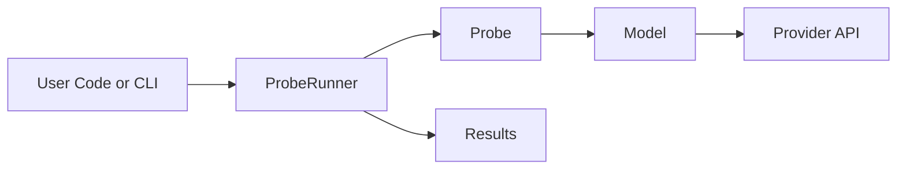
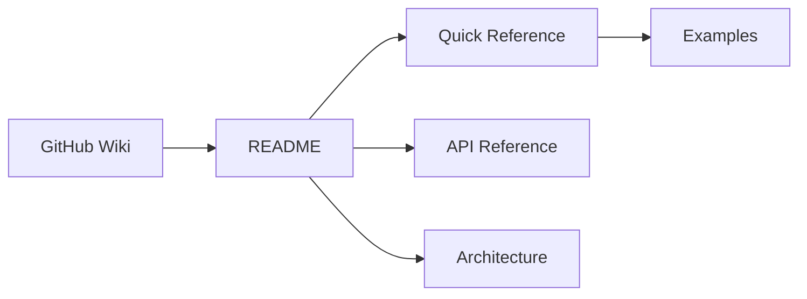

<div align="center">
  <h1 align="center">insideLLMs</h1>
  <p align="center">
    <strong>Cross-model behavioural probe harness for LLM evaluation and comparison</strong>
  </p>
  <p align="center">
    <a href="#quick-start">Quick Start</a> &bull;
    <a href="#features">Features</a> &bull;
    <a href="#cli-usage">CLI</a> &bull;
    <a href="#documentation">Docs</a>
  </p>
</div>

<p align="center">
  <a href="https://github.com/dr-gareth-roberts/insideLLMs/actions/workflows/ci.yml"></a>
  <a href="https://codecov.io/gh/dr-gareth-roberts/insideLLMs"></a>
  
  <a href="https://github.com/dr-gareth-roberts/insideLLMs/blob/main/LICENSE"></a>
</p>

---

**insideLLMs** is a Python library and CLI for comparing LLM behaviour across models using shared probes and datasets. It produces deterministic run artefacts you can store, report on, and diff in CI.

```python
from insideLLMs import DummyModel, LogicProbe, ProbeRunner

# Evaluate any LLM in a few lines (DummyModel runs without API keys)
model = DummyModel()
results = ProbeRunner(model, LogicProbe()).run([
    "If all cats are mammals and all mammals breathe, do all cats breathe?"
])
```

---

## Why insideLLMs?

- Compare models on the same probes and datasets.
- Record-first artefacts: `records.jsonl`, `summary.json`, `report.html`, `diff.json`.
- Deterministic harness spine for CI gating (run -> report -> diff).
- Pluggable adapters for hosted and local models, plus `DummyModel` for dry runs.
- Optional utilities for caching, rate limiting, cost tracking, and safety checks.

---

## Requirements

- **Python**: 3.10 or higher
- **OS**: Tested on Linux, macOS, Windows

---

## Quick Start

### Installation

Not published on PyPI yet. Install from source:

```bash
git clone https://github.com/dr-gareth-roberts/insideLLMs.git
cd insideLLMs
python -m venv .venv
source .venv/bin/activate  # Windows: .venv\\Scripts\\activate
pip install -e ".[all]"
```

Alternatively, if you use [uv](https://github.com/astral-sh/uv):

```bash
uv pip install -e ".[all]"
```

Extras: `.[nlp]`, `.[visualization]`, `.[dev]`.

### Your First Evaluation

```python
from insideLLMs import DummyModel, LogicProbe, BiasProbe, ProbeRunner
from insideLLMs import save_results_json

# Use DummyModel for testing (or any real model)
model = DummyModel()

# Run multiple probes
for probe in [LogicProbe(), BiasProbe()]:
    runner = ProbeRunner(model, probe)
    results = runner.run([
        "What is 2 + 2?",
        "If A implies B and B implies C, does A imply C?",
    ])
    print(f"{probe.name}: {len(results)} results")

# Save results
save_results_json(results, "evaluation_results.json")
```

### With Real Models

```python
from insideLLMs.models import AnthropicModel, HuggingFaceModel, OpenAIModel

# Ensure relevant API keys are set in the environment
gpt4 = OpenAIModel(model_name="gpt-4o")
claude = AnthropicModel(model_name="claude-opus-4-5-20251101")

hf = HuggingFaceModel(model_name="gpt2")

# Local models
from insideLLMs.models import LlamaCppModel, OllamaModel

llama = OllamaModel(model_name="llama3.2")
```

---

## Behavioural Harness

Run a multi-model, multi-probe sweep from a single config. The harness writes:

- `records.jsonl`: one row per example per model per probe
- `summary.json`: aggregates and confidence intervals
- `report.html`: human-readable comparison

For backwards compatibility, `results.jsonl` is kept alongside `records.jsonl`.

```yaml
# harness.yaml
models:
  - type: openai
    args:
      model_name: gpt-4o
  - type: anthropic
    args:
      model_name: claude-opus-4-5-20251101
probes:
  - type: logic
    args: {}
  - type: bias
    args: {}
dataset:
  format: jsonl
  path: data/questions.jsonl
max_examples: 50
output_dir: results
```

```bash
insidellms harness harness.yaml
```

If `plotly` is installed, the report is interactive; otherwise a basic HTML summary is generated.
See `examples/harness.yaml` for a ready-to-edit config.

---

## Architecture

See `ARCHITECTURE.md` for detailed runtime and flow diagrams.



---

## Toolkit (Optional)

Use only what you need:

- Probes for logic, factuality, bias, safety, code, and instruction-following.
- Analysis helpers for calibration, sensitivity, and hallucination checks.
- Operational tools for caching, rate limiting, retries, and cost tracking.
- Tracking and export hooks (local, W&B, MLflow; CSV/JSON/Markdown).
- Visualisation helpers (HTML report; Plotly dashboards if installed).

See the [GitHub Wiki](https://github.com/dr-gareth-roberts/insideLLMs/wiki) for the full module list and examples.

---

## CLI Usage

`insideLLMs` includes a command-line interface to run experiments and manage your project.

Quickstart (deterministic run directory + validation):

```bash
insidellms run config.yaml --run-dir ./my_run
# Creates: ./my_run/manifest.json, ./my_run/records.jsonl, ./my_run/config.resolved.yaml
insidellms validate ./my_run
```

Official workflow (records-only spine):

```bash
# Run an experiment or harness
insidellms run config.yaml
insidellms harness harness.yaml

# Rebuild summary/report without model calls
insidellms report ./my_run

# Compare runs in CI (non-zero exit on regressions)
insidellms diff ./baseline ./candidate --fail-on-regressions
```

Determinism scope (default stance):

- The harness spine (run → records → report → diff) is deterministic by design, including run IDs and timestamps.
- Other modules remain pragmatic (for example HITL, deployment, caching, orchestration) unless they become part of the CI gating surface.

Baseline vs candidate example (avoid overwriting):

```bash
# Establish a baseline
insidellms harness harness.yaml --run-dir ./runs/baseline
insidellms report ./runs/baseline

# Compare a new candidate
insidellms harness harness.yaml --run-dir ./runs/candidate
insidellms report ./runs/candidate
insidellms diff ./runs/baseline ./runs/candidate --fail-on-regressions
```

CI gating tip: `insidellms diff --fail-on-regressions` exits non-zero on behavioural regressions, so CI can fail the job. Keep the baseline `records.jsonl` somewhere durable (repo or artefact storage).

Machine-readable diff output (DiffReport schema):

```bash
insidellms diff ./baseline ./candidate --format json --output diff.json
insidellms schema DiffReport > diff.schema.json
```

---

## Environment Variables

The library uses environment variables for API authentication and configuration.

### API Keys
- `OPENAI_API_KEY`: Required for OpenAI models.
- `ANTHROPIC_API_KEY`: Required for Anthropic models.
- `GOOGLE_API_KEY`: Required for Google Gemini models.
- `CO_API_KEY` or `COHERE_API_KEY`: Required for Cohere models.
- `HUGGINGFACEHUB_API_TOKEN`: Optional for private Hugging Face models.

### Configuration
- `INSIDELLMS_RUN_ROOT`: Override the default run directory for artifacts (manifest/records/config).
- `NO_COLOR`: If set to any value, disables colored output in the CLI.
- `FORCE_COLOR`: If set to any value, forces colored output.

---

## Project Structure

```text
insideLLMs/
├── data/               # Default directory for datasets and results
├── examples/           # Example scripts and usage patterns
├── insideLLMs/         # Core package source code
│   ├── models/         # Model provider implementations
│   ├── nlp/            # NLP utility functions
│   ├── probes/         # Evaluation probe implementations
│   ├── cli.py          # Command-line interface logic
│   └── ...             # Other core modules
├── tests/              # Test suite
├── pyproject.toml      # Build system and dependency configuration
└── README.md           # This file
```

---

## Testing

```bash
pip install -e ".[dev]"

pytest

# Optional coverage
pytest --cov=insideLLMs
```

---

## Model Providers

Adapters are available for:

- OpenAI (e.g. GPT-4o)
- Anthropic (e.g. Claude Opus 4.5 / Haiku)
- Google (Gemini)
- Cohere (Command)
- Hugging Face Transformers
- Ollama, llama.cpp, vLLM
- `DummyModel` for dry runs

Availability depends on credentials and optional provider dependencies.

---

## Module Map

Key packages:

- Core: `insideLLMs.runner`, `insideLLMs.models`, `insideLLMs.probes`
- Datasets + metrics: `insideLLMs.benchmark_datasets`, `insideLLMs.evaluation`
- Ops: `insideLLMs.caching`, `insideLLMs.rate_limiting`, `insideLLMs.cost_tracking`
- Risk checks: `insideLLMs.safety`, `insideLLMs.injection`, `insideLLMs.hallucination`
- Prompt tooling: `insideLLMs.templates`, `insideLLMs.chains`, `insideLLMs.template_versioning`
- Outputs: `insideLLMs.visualization`, `insideLLMs.export`

See the [API Reference](API_REFERENCE.md) for the full module list.

---

## Documentation

- **[GitHub Wiki](https://github.com/dr-gareth-roberts/insideLLMs/wiki)** - Living documentation and guides
- **[Documentation Index](DOCUMENTATION_INDEX.md)** - Start here for guided navigation
- **[API Reference](API_REFERENCE.md)** - API documentation
- **[Quick Reference](QUICK_REFERENCE.md)** - Common patterns and snippets
- **[Architecture](ARCHITECTURE.md)** - System diagrams and execution flows
- **[Examples](examples/)** - Working example scripts



---

## Roadmap (Indicative)

These are potential next steps rather than commitments:

- [ ] **Model Support**: Broader coverage of hosted and local providers.
- [ ] **Registry Integration**: Deeper integration of existing components with the plugin registry.
- [ ] **Reporting UX**: More flexible report layouts and comparison views.
- [ ] **Prompt Optimisation**: Optional tooling for iterating prompts based on evaluation results.
- [ ] **Documentation**: Additional guides and examples in the Wiki.

---

## Contributing

```bash
git clone https://github.com/dr-gareth-roberts/insideLLMs
cd insideLLMs
python -m venv .venv
source .venv/bin/activate  # Windows: .venv\\Scripts\\activate
pip install -e ".[dev]"
pytest 
```

---

## License

MIT License - Copyright (c) 2026 Dr Gareth Roberts
