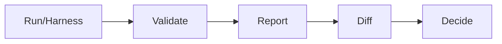

<div align="center">
  
  <h1 align="center">insideLLMs</h1>
  <p align="center">
    <strong>Deterministic behavioural probe harness for LLM comparison</strong>
  </p>
  <p align="center">
    <a href="#overview">Overview</a> &bull;
    <a href="#workflow">Workflow</a> &bull;
    <a href="#quickstart">Quickstart</a> &bull;
    <a href="#docs">Docs</a>
  </p>
</div>

<p align="center">
  <a href="https://codecov.io/gh/dr-gareth-roberts/insideLLMs"></a>
  
  <a href="https://github.com/dr-gareth-roberts/insideLLMs/blob/main/LICENSE"></a>
</p>

---

## Overview

insideLLMs is a Python library and CLI for comparing LLM behaviour across models using shared probes and datasets. The harness is deterministic by design, so you can store run artefacts and reliably diff behaviour in CI.

Adapters cover hosted and local models (OpenAI, Anthropic, Google, Cohere, Hugging Face, Ollama, llama.cpp, vLLM), plus `DummyModel` for dry runs.

## Workflow

The deterministic spine is records-first and CI-friendly:



## Outputs

- `records.jsonl`: one row per example per model per probe (canonical)
- `summary.json`: aggregates and uncertainty estimates (where available)
- `report.html`: human-readable comparison
- `diff.json`: machine-readable diff (`DiffReport` schema)

For backwards compatibility, `results.jsonl` is kept alongside `records.jsonl`.

## Quickstart

Not published on PyPI yet. Install from source:

```bash
git clone https://github.com/dr-gareth-roberts/insideLLMs.git
cd insideLLMs
python -m venv .venv
source .venv/bin/activate  # Windows: .venv\\Scripts\\activate
pip install -e ".[all]"
```

Run a harness and produce reports:

```bash
insidellms harness harness.yaml --run-dir ./runs/candidate
insidellms report ./runs/candidate
insidellms diff ./runs/baseline ./runs/candidate --fail-on-regressions
```

## CI Diff-Gating

For PRs, you can gate on any behavioural drift by running a small deterministic harness on the
base SHA and on the PR, then diffing the outputs:

```bash
insidellms harness ci/harness.yaml --run-dir .tmp/runs/head --skip-report
insidellms diff .tmp/runs/base .tmp/runs/head --fail-on-changes
```

## Determinism Scope

- The harness spine (run -> records -> report -> diff) is deterministic, including run IDs and timestamps.
- Other modules remain pragmatic unless they become part of the CI gating surface.

## Docs

- [GitHub Wiki](https://github.com/dr-gareth-roberts/insideLLMs/wiki)
- [Documentation Index](DOCUMENTATION_INDEX.md)
- [API Reference](API_REFERENCE.md)
- [Quick Reference](QUICK_REFERENCE.md)
- [Architecture](ARCHITECTURE.md)
- [Examples](examples/)

## Licence

MIT. See `LICENSE`.
