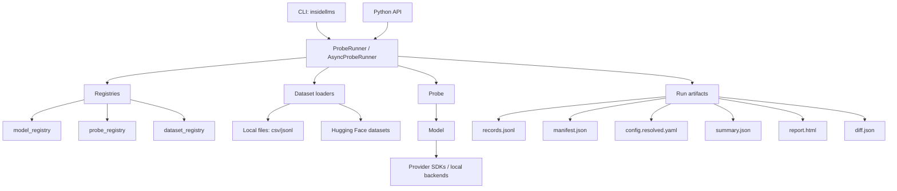
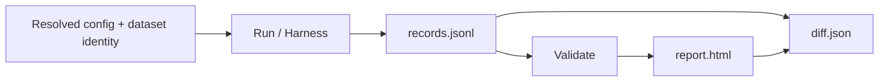
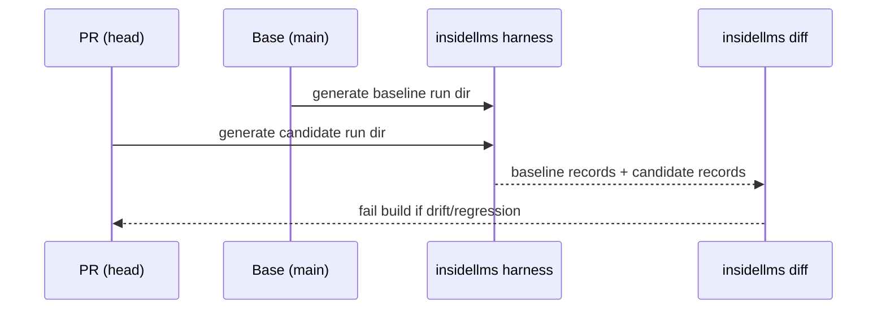
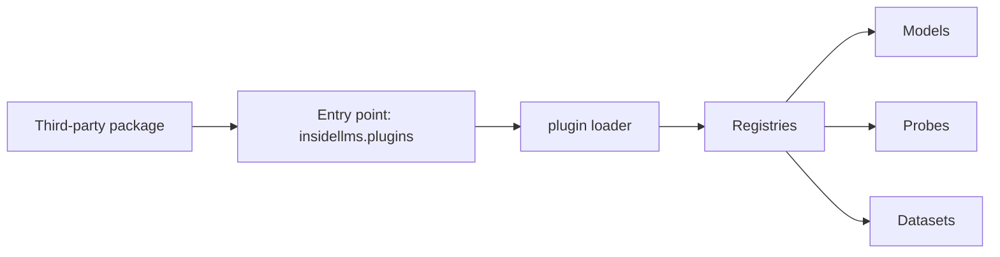

## High-level map

```mermaid
flowchart TD
  CLI[CLI: insidellms] --> Runner[ProbeRunner / AsyncProbeRunner]
  API[Python API] --> Runner

  Runner --> Registry[Registries]
  Registry --> ModelReg[model_registry]
  Registry --> ProbeReg[probe_registry]
  Registry --> DatasetReg[dataset_registry]

  Runner --> Dataset[Dataset loaders]
  Dataset --> Local[Local files: csv/jsonl]
  Dataset --> HF[Hugging Face datasets]

  Runner --> Probe[Probe]
  Probe --> Model[Model]

  Model --> Providers[Provider SDKs / local backends]

  Runner --> Artifacts[Run artifacts]
  Artifacts --> Records[records.jsonl]
  Artifacts --> Manifest[manifest.json]
  Artifacts --> Resolved[config.resolved.yaml]
  Artifacts --> Summary[summary.json]
  Artifacts --> Report[report.html]
  Artifacts --> Diff[diff.json]
```

## Deterministic spine

```mermaid
flowchart LR
  Config[Resolved config + dataset identity] --> Run[Run / Harness]
  Run --> Records[records.jsonl]
  Records --> Validate[Validate]
  Validate --> Report[report.html]
  Records --> Diff[diff.json]
  Report --> Diff
```

## CI diff-gating

```mermaid
sequenceDiagram
  participant PR as PR (head)
  participant Base as Base (main)
  participant Run as insidellms harness
  participant Diff as insidellms diff

  Base->>Run: generate baseline run dir
  PR->>Run: generate candidate run dir
  Run-->>Diff: baseline records + candidate records
  Diff-->>PR: fail build if drift/regression
```

## Extension points (plugins)

```mermaid
flowchart LR
  PluginPkg[Third-party package] --> EP[Entry point: insidellms.plugins]
  EP --> Loader[plugin loader]
  Loader --> Reg[Registries]
  Reg --> Models[Models]
  Reg --> Probes[Probes]
  Reg --> Datasets[Datasets]
```
