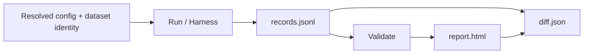

insideLLMs is designed so the “run → records → report → diff” spine can be used for CI
diff-gating.

> Canonical source: `docs/DETERMINISM.md` and `docs/ARTIFACT_CONTRACT.md`.
> This wiki page is a practical guide and should stay aligned with those contracts.



## What’s Deterministic?

When you run via `insidellms run` or `insidellms harness`, insideLLMs writes:

- `records.jsonl` (canonical record stream)
- `manifest.json` (run metadata)
- `summary.json`
- `report.html`

By default, the `run_id` and emitted timestamps are derived deterministically from the resolved
config snapshot. You can override this with `--run-id`.

The deterministic contract is *byte-for-byte* for the same inputs/config:

- Canonical JSON emission for on-disk artifacts (stable key ordering and separators).
- Stable ordering for plugin discovery and filesystem listings where relevant.
- Idempotent reporting (`insidellms report` over the same run dir does not drift).
- Resume safety: resumable runs validate the stored input fingerprint against the current prompt set,
  preventing mixed artifacts.

## Volatile Fields (Intentionally Omitted)

Some values are inherently non-deterministic (wall-clock timing, shell invocation, host metadata).
To keep the diff surface stable, canonical artifacts omit these:

- `ResultRecord.latency_ms` is persisted as `null`.
- `manifest.json:command` is persisted as `null`.

If you need timing/host details, use tracing/telemetry rather than the canonical CI artifacts.

## Dataset Identity (`dataset_hash`)

For local file datasets (`format: csv|jsonl`), if a hash is not provided in the config, insideLLMs
computes a deterministic `dataset_hash=sha256:<file-bytes>` and includes it in `manifest.json`.
This makes `run_id` sensitive to dataset content changes.

```mermaid
flowchart TD
  Dataset[Dataset file bytes] --> Hash[dataset_hash = sha256(file_bytes)]
  Hash --> RunId[run_id derived from resolved config]
  RunId --> Time[Deterministic timestamps]
  RunId --> Dir[Run directory identity]
```

## CI Diff-Gating Pattern

1) Produce a baseline run dir.
2) Produce a candidate run dir using the exact same harness config.
3) Diff the two run dirs and fail the build if anything changes.

```bash
insidellms harness ci/harness.yaml --run-dir .tmp/runs/base --overwrite --skip-report
insidellms harness ci/harness.yaml --run-dir .tmp/runs/head --overwrite --skip-report
insidellms diff .tmp/runs/base .tmp/runs/head --fail-on-changes
```

## Recommended CI Harness

Use the repo’s minimal, offline harness:

- Config: `ci/harness.yaml`
- Dataset: `ci/harness_dataset.jsonl`

It uses `DummyModel` only (no API keys) and probes that accept dict inputs.

## Useful Diff Flags

- `--fail-on-regressions`: fail only on score/status regressions
- `--fail-on-changes`: fail on any difference (including additions/removals)
- `--fail-on-trace-drift`: fail if trace fingerprints drift (when enabled)
- `--fail-on-trace-violations`: fail if contract violations increase (when enabled)
- `--fail-on-trajectory-drift`: fail when tool/agent execution trajectories drift
- `--judge --judge-policy {strict,balanced}`: deterministic verdict layer for change triage
- `--interactive`: local snapshot acceptance workflow for intentional updates
- `--output-fingerprint-ignore`: ignore volatile keys when fingerprinting structured outputs

## Trace-aware diffing (optional)

Trace flags only apply when records include trace data:

- `custom.trace.fingerprint.value` or `custom.trace_fingerprint`
- `custom.trace.violations` or `custom.trace_violations`

If these fields are missing, trace drift and trace violation checks are no-ops.

For structured outputs with volatile fields, use:

```bash
insidellms diff ... --output-fingerprint-ignore timestamp,request_id
```

See [Tracing and Fingerprinting](Tracing-and-Fingerprinting.md) for details.

## Verifiable workflows

For provenance-oriented command flows (`attest`, `sign`, `verify-signatures`), see:

- [Verifiable Evaluation](advanced/Verifiable-Evaluation.md)
- [CLI Reference](reference/CLI.md)
