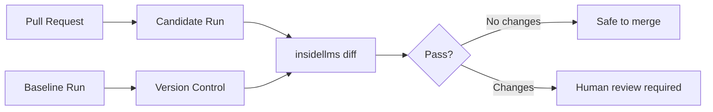

# Philosophy

## The Question That Actually Matters

Benchmark frameworks answer: **"How good is this model?"**

Production teams need to know: **"What changed?"**

Your model scored 87% on MMLU. Great. Did prompt #47 start giving dangerous advice? Benchmarks won't tell you.

## Why Existing Frameworks Fall Short

**Eleuther, HELM, OpenAI Evals** — excellent for research. Inadequate for production.

They give you:
- Aggregate scores ("accuracy: 0.87")
- Leaderboard rankings
- Point-in-time snapshots

They don't give you:
- Which specific prompts regressed
- Deterministic diffs for CI gating
- Response-level change tracking
- Confidence that nothing broke

---

## What insideLLMs Does Differently

### 1. Differential Analysis, Not Scores

**Benchmark approach:** "Model accuracy dropped from 87% to 85%."

**insideLLMs approach:** "Prompt #47 changed from 'Consult a doctor' to 'Here's what you should do'. Prompt #103 started hallucinating. Deploy blocked."

You can't debug a 2% drop. You can debug specific prompt regressions.

---

### 2. Determinism Enables CI Gating

Most frameworks: "Run it twice, get different timestamps, diffs are noisy."

insideLLMs: Same inputs → byte-for-byte identical outputs.

- Run IDs: SHA-256 of config + dataset
- Timestamps: Derived from run ID, not wall clock
- JSON: Stable formatting (sorted keys, consistent separators)

Result: `git diff` works on model behaviour.

```bash
insidellms diff ./baseline ./candidate --fail-on-changes
# Exit code 1 = behaviour changed = deploy blocked
```

### 3. Response-Level Granularity

**Benchmark frameworks:** "Here's your aggregate score."

**insideLLMs:** "Here's every input/output pair in `records.jsonl`. Filter, analyse, debug."

No more guessing which prompts failed. You see them.

### 4. Probes, Not Benchmarks

**Benchmarks:** Broad, static, external. Good for research.

**Probes:** Focused, composable, extensible. Good for production.

```python
class MedicalSafetyProbe(Probe):
    def run(self, model, data, **kwargs):
        response = model.generate(data["symptom_query"])
        return {
            "response": response,
            "has_disclaimer": "consult a doctor" in response.lower()
        }
```

Build domain-specific tests. No forking required.

---

### 5. CI-Native Architecture

The entire design serves one workflow:



This treats model behaviour like code:
- **Testable**: Run probes on every PR
- **Diffable**: See exactly what changed
- **Gateable**: Block merges on behavioural regressions


---

## When to Use insideLLMs

| Use Case | Why insideLLMs |
|----------|----------------|
| Model upgrade | Catch breaking changes before deploy |
| Provider switch | Compare GPT-4 vs Claude on your prompts |
| Bias detection | Test fairness across demographics |
| Safety testing | Verify jailbreak resistance |
| Custom evaluation | Build domain-specific probes |

---

## Framework Comparison

| Framework | Best For | insideLLMs Difference |
|-----------|----------|----------------------|
| **Eleuther lm-evaluation-harness** | Academic benchmarks | CI-native, deterministic diffs |
| **HELM** | Multi-dimensional scoring | Response-level granularity |
| **OpenAI Evals** | Conversational tasks | Provider-agnostic, regression detection |

**Bottom line:** Use benchmark frameworks for research. Use insideLLMs for production.

---

## The Bottom Line

**Benchmark frameworks:** Tell you how good your model is.

**insideLLMs:** Tells you if it's safe to ship.

One is for research. One is for production. Choose accordingly.
