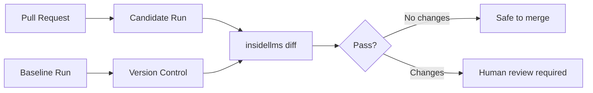

# Philosophy

Why insideLLMs exists and how it differs from existing evaluation frameworks.

---

## The Problem

Traditional LLM evaluation frameworks focus on benchmark scores: accuracy on MMLU, F1 on SQuAD, pass rates on HumanEval. These metrics answer the question:

> "How good is this model?"

But for teams shipping LLM-powered products, a different question matters more:

> "Did my model's behaviour change?"

A model that scores 85% on a benchmark isn't inherently better than one scoring 82%. What matters is whether the behaviours your users depend on have regressed.

---

## Benchmarks vs. Behavioural Testing

| Aspect | Benchmark Frameworks | insideLLMs |
|--------|---------------------|------------|
| **Primary question** | "What's the score?" | "What changed?" |
| **Output** | Aggregate metrics | Individual responses |
| **Reproducibility** | Often inconsistent | Byte-for-byte deterministic |
| **CI integration** | Afterthought | First-class design goal |
| **Granularity** | Dataset-level | Response-level |
| **Extensibility** | Fork to customize | Compose probes |

Benchmark frameworks tell you where a model ranks on a leaderboard. insideLLMs tells you whether your deployment is safe to ship.

---

## Core Principles

### 1. Differential Analysis Over Absolute Scores

The most useful evaluation isn't "Model X scored 87%." It's "Model X's response to prompt #47 changed from A to B."

insideLLMs preserves every input/output pair in `records.jsonl`, enabling:
- Exact identification of behavioural changes
- Regression tracking to specific prompts
- Root cause analysis when things break

### 2. Determinism as Foundation

Most evaluation frameworks treat reproducibility as a nice-to-have. insideLLMs makes it fundamental:

- **Run IDs** are SHA-256 hashes of inputs
- **Timestamps** derive from run IDs, not wall clocks
- **Artifacts** have stable JSON formatting (sorted keys, consistent separators)

This isn't academic rigor for its own sake. It's what makes `git diff` work on model behaviour:

```bash
# This only works if artifacts are deterministic
insidellms diff ./baseline ./candidate --fail-on-changes
```

### 3. Probes Over Benchmarks

Benchmarks are:
- **Broad**: Cover many capabilities at once
- **Static**: Fixed datasets, frozen in time
- **External**: Maintained by third parties

Probes are:
- **Focused**: Test specific behaviours (bias in salary advice, logical consistency, jailbreak resistance)
- **Composable**: Combine probes for your use case
- **Extensible**: Build custom probes without forking the framework

```python
# Your domain-specific probe
class MedicalSafetyProbe(Probe):
    def run(self, model, data, **kwargs):
        response = model.generate(data["symptom_query"])
        return {
            "response": response,
            "contains_disclaimer": "consult a doctor" in response.lower()
        }
```

### 4. CI-Native Architecture

The entire design serves one workflow:



This treats model behaviour like code:
- **Testable**: Run probes on every PR
- **Diffable**: See exactly what changed
- **Gateable**: Block merges on behavioural regressions

### 5. Response-Level Granularity

Aggregate metrics hide important details. If a model's accuracy drops from 90% to 88%, you need to know:
- Which specific prompts failed?
- Did new failures appear, or did old ones get worse?
- Are the failures in critical areas or edge cases?

`records.jsonl` answers these questions:

```jsonl
{"example_id": "47", "input": {...}, "output": "...", "status": "success"}
{"example_id": "48", "input": {...}, "output": "...", "status": "error"}
```

---

## What insideLLMs Is Not

**Not a leaderboard generator.** If you want to rank models on public benchmarks, use Eleuther's lm-evaluation-harness or HELM.

**Not a training framework.** insideLLMs evaluates models; it doesn't train them.

**Not a prompt optimisation tool.** It tests behaviour; it doesn't improve it.

**Not a real-time monitoring system.** It's for pre-deployment testing, not production observability.

---

## When to Use insideLLMs

Use insideLLMs when you need to:

1. **Detect regressions** before they reach users
2. **Compare models** for a specific use case (not general capability)
3. **Gate deployments** on behavioural tests
4. **Track changes** across model versions
5. **Build custom evaluations** for domain-specific behaviours

---

## The Deterministic Spine

The "run -> records -> report -> diff" pipeline is the core abstraction:

```
Config + Dataset
      |
      v
   Runner (ProbeRunner / AsyncProbeRunner)
      |
      v
records.jsonl (canonical, deterministic)
      |
      +---> summary.json (aggregates)
      +---> report.html (human-readable)
      +---> diff.json (via insidellms diff)
```

Every component is designed for determinism:
- Configs resolve to stable snapshots
- Datasets are content-hashed
- Timestamps derive from content, not time
- JSON uses stable formatting

This makes the entire pipeline diffable.

---

## Comparison with Existing Frameworks

### Eleuther lm-evaluation-harness

**Focus**: Broad benchmark coverage (300+ tasks)
**Strength**: Comprehensive academic benchmarks
**Gap**: No CI integration, limited reproducibility, aggregate-only outputs

### HELM (Stanford)

**Focus**: Holistic evaluation with multiple metrics
**Strength**: Multi-dimensional assessment
**Gap**: Heavy infrastructure, not designed for CI gating

### OpenAI Evals

**Focus**: Conversational and instruction-following tasks
**Strength**: Good prompt templates
**Gap**: OpenAI-centric, limited determinism guarantees

### insideLLMs

**Focus**: Behavioural regression testing for CI
**Strength**: Deterministic, diffable, CI-native
**Gap**: Fewer built-in benchmarks (by design)

---

## Summary

insideLLMs exists because shipping LLM-powered products requires:

1. **Knowing what changed**, not just what scored well
2. **Trusting that tests are reproducible**, not hoping they are
3. **Blocking bad deploys automatically**, not catching them in production
4. **Understanding individual failures**, not just aggregate metrics

If your goal is a leaderboard position, use benchmark frameworks. If your goal is shipping reliable LLM products, use insideLLMs.
