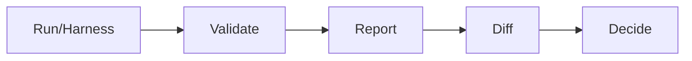
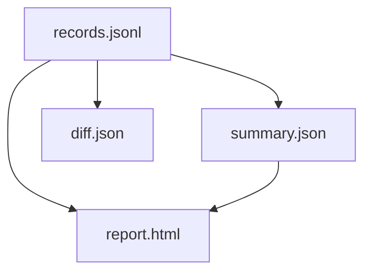

## records.jsonl

Canonical run log: one JSON object per line, per example per model per probe.
For backwards compatibility, `results.jsonl` is kept as a symlink or copy.

Typical fields:

- `model`, `probe`, `dataset`
- `example_id`, `input`, `output`
- `status`, `error`, `error_type`
- `scores`, `primary_metric`, `latency_ms` (persisted as `null` in canonical artifacts)
- `started_at`, `completed_at`
- `custom.harness.*` (for harness grouping metadata)

Note: the canonical artifacts are designed for deterministic CI diff-gating; volatile runtime
details (like wall-clock latency) are intentionally excluded from the diff surface.

## summary.json

Aggregates and confidence intervals (where possible), grouped by model and probe.
This file is designed for downstream dashboards or quick checks in CI.

## validate

Use `insidellms validate ./run_dir` to check manifest and records against the output schema
before reporting or diffing.

You can also validate individual artifacts:

```bash
insidellms schema validate --name ResultRecord --input ./run_dir/records.jsonl
insidellms schema validate --name RunManifest --input ./run_dir/manifest.json
```

## report.html

A human-readable comparison report. If `plotly` is installed it is interactive;
otherwise a basic HTML report is generated.

## diff.json (DiffReport)

`insidellms diff --format json --output diff.json` emits a machine-readable
comparison with regressions, improvements, and change metadata. Use
`insidellms schema DiffReport` to inspect the JSON Schema.

For CI usage patterns, see [Determinism and CI](Determinism-and-CI.md).

## Tips

- Treat outputs as sensitive. Do not store PII or secrets in results.
- Use `max_examples` to control cost and runtime.
- For experiment tracking (W&B/MLflow/TensorBoard/local logs), see
  [Experiment Tracking](Experiment-Tracking.md).
- For caching/concurrency/rate limiting guidance, see [Performance and Caching](Performance-and-Caching.md).
- For trace-aware diffing and structured output fingerprints, see
  [Tracing and Fingerprinting](Tracing-and-Fingerprinting.md).
