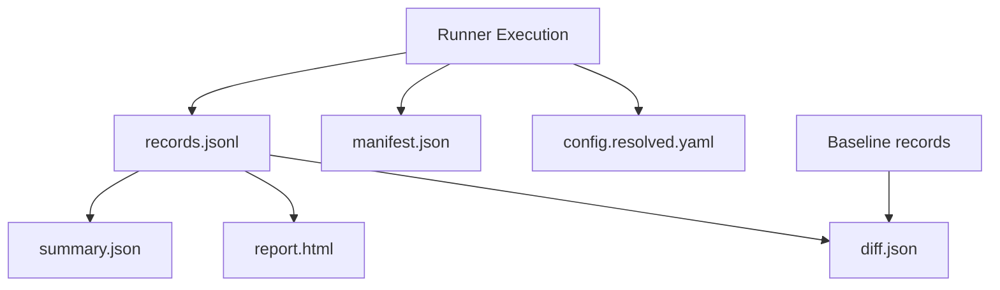

# Artifacts

insideLLMs produces structured artifacts for analysis and CI integration.

## Overview



## Artifact Types

| Artifact | Purpose | When Created |
|----------|---------|--------------|
| `records.jsonl` | Raw results | During run |
| `manifest.json` | Run metadata | After completion |
| `config.resolved.yaml` | Full config | Start of run |
| `summary.json` | Aggregated stats | After completion |
| `report.html` | Human report | On request |
| `diff.json` | Run comparison | Via `insidellms diff` |

---

## records.jsonl

The canonical output. One JSON line per result:

```json
{
  "schema_version": "1.0.0",
  "run_id": "a1b2c3d4...",
  "started_at": "2009-03-14T15:09:26.535897+00:00",
  "completed_at": "2009-03-14T15:09:26.535898+00:00",
  "model": {
    "model_id": "gpt-4o",
    "provider": "openai"
  },
  "probe": {
    "probe_id": "logic"
  },
  "dataset": {
    "dataset_id": "test.jsonl",
    "dataset_hash": "sha256:abc123..."
  },
  "example_id": "0",
  "input": {"question": "What is 2 + 2?"},
  "output": "4",
  "status": "success",
  "error": null,
  "error_type": null
}
```

### Key Fields

| Field | Description |
|-------|-------------|
| `schema_version` | Artifact schema version |
| `run_id` | Deterministic run identifier |
| `started_at` | Deterministic timestamp |
| `model` | Model specification |
| `probe` | Probe specification |
| `example_id` | Input identifier |
| `input` | Original input data |
| `output` | Model/probe output |
| `status` | `"success"` or `"error"` |

---

## manifest.json

Run-level metadata:

```json
{
  "schema_version": "1.0.0",
  "run_id": "a1b2c3d4...",
  "created_at": "2009-03-14T15:09:26.535897+00:00",
  "started_at": "2009-03-14T15:09:26.535897+00:00",
  "completed_at": "2009-03-14T15:09:26.535899+00:00",
  "run_completed": true,
  "library_version": "0.1.0",
  "python_version": "3.11.0",
  "platform": "macOS-14.0-arm64",
  "model": {...},
  "probe": {...},
  "dataset": {...},
  "record_count": 100,
  "success_count": 98,
  "error_count": 2,
  "records_file": "records.jsonl"
}
```

---

## config.resolved.yaml

The fully resolved configuration:

```yaml
model:
  type: openai
  args:
    model_name: gpt-4o
    temperature: 0.7
probe:
  type: logic
  args: {}
dataset:
  format: jsonl
  path: /absolute/path/to/data.jsonl
  dataset_hash: sha256:abc123...
```

Useful for:
- Reproducing runs exactly
- Debugging path resolution
- Auditing configurations

---

## summary.json

Aggregated statistics:

```json
{
  "schema_version": "1.0.0",
  "run_id": "a1b2c3d4...",
  "models": {
    "gpt-4o": {
      "success_rate": 0.98,
      "example_count": 100,
      "error_count": 2
    }
  },
  "probes": {
    "logic": {
      "success_rate": 0.98
    }
  },
  "overall": {
    "success_rate": 0.98,
    "total_examples": 100
  }
}
```

---

## report.html

Standalone HTML report with:
- Model comparison tables
- Success/failure breakdown
- Individual response viewer
- Filtering and search

Open directly in any browser.

---

## diff.json

Comparison between two runs:

```json
{
  "baseline_run_id": "abc123...",
  "candidate_run_id": "def456...",
  "baseline_path": "/path/to/baseline",
  "candidate_path": "/path/to/candidate",
  "changes": [
    {
      "example_id": "42",
      "field": "output",
      "baseline": "The answer is 4",
      "candidate": "The answer is four"
    }
  ],
  "summary": {
    "total_examples": 100,
    "changed": 3,
    "unchanged": 97,
    "added": 0,
    "removed": 0
  }
}
```

---

## Working with Artifacts

### Reading Records

```python
import json

records = []
with open("run_dir/records.jsonl") as f:
    for line in f:
        records.append(json.loads(line))
```

### Generating Summary

```bash
# summary.json is emitted by run/harness; regenerate report artifacts if needed
insidellms report ./run_dir
```

### Generating HTML Report

```bash
insidellms report ./run_dir
# Creates ./run_dir/report.html
```

### Comparing Runs

```bash
insidellms diff ./baseline ./candidate
```

---

## Schema Versions

Artifacts are versioned:

| Version | Changes |
|---------|---------|
| `1.0.0` | Initial schema |
| `1.0.1` | Added `run_completed` flag |

Check version:

```python
record = json.loads(line)
version = record["schema_version"]
```

---

## Determinism

All artifacts are deterministic:
- Sorted JSON keys
- Consistent separators
- Timestamps derived from run_id
- Stable record ordering

See [Determinism](Determinism.md) for details.

---

## See Also

- [Understanding Outputs](../getting-started/Understanding-Outputs.md) - Beginner guide
- [Determinism](Determinism.md) - Why artifacts are stable
- [CLI Reference](../reference/CLI.md) - Commands for working with artifacts
