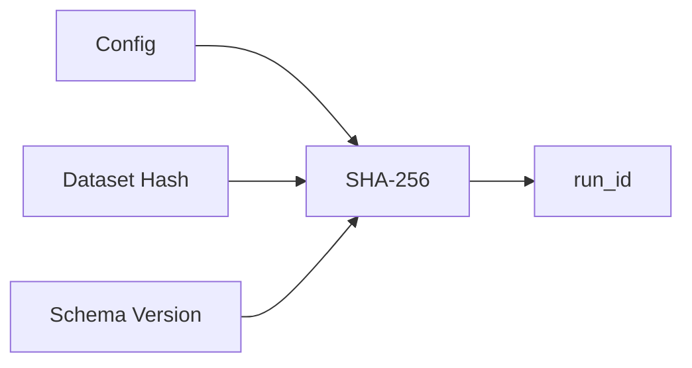
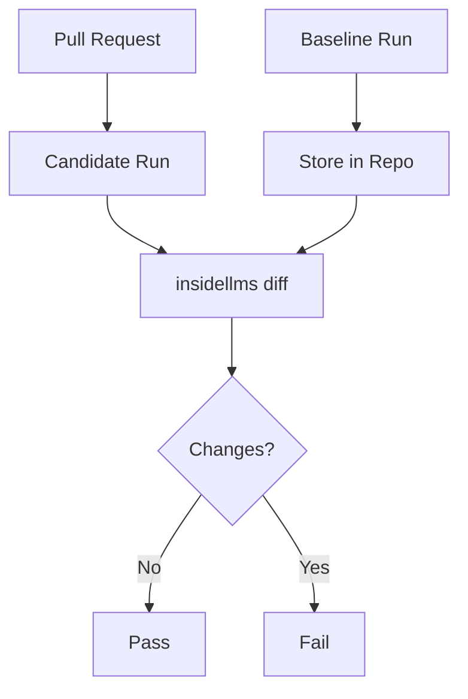

# Determinism

**Same inputs → byte-for-byte identical outputs.**

> Canonical source: `docs/DETERMINISM.md` and `docs/ARTIFACT_CONTRACT.md`.
> This concept page summarizes the contract for quick navigation.

Enables:
- CI diff-gating (block regressions)
- Reproducibility (re-run = same artefacts)
- Caching (skip computed results)
- Debugging (isolate changes)

## What's Deterministic

| Artifact | Deterministic? | How |
|----------|----------------|-----|
| `run_id` | Yes | SHA-256 of config + dataset |
| `started_at` / `completed_at` | Yes | Derived from run_id |
| `records.jsonl` | Yes | Stable JSON, sorted keys |
| `manifest.json` | Yes | Stable JSON, sorted keys |
| `diff.json` | Yes | Stable JSON, sorted keys |
| Model responses | No | API-dependent |
| Actual latency | No | Runtime-dependent |

## How It Works

### Run ID Generation



```python
run_id = sha256(
    schema_version +
    model_spec +
    probe_spec +
    dataset_hash +
    probe_kwargs
)[:32]
```

### Deterministic Timestamps

Timestamps are **derived from the run_id**, not wall-clock time:

```python
base_time = hash_to_datetime(run_id)
item_started_at = base_time + (index * 2) microseconds
item_completed_at = base_time + (index * 2 + 1) microseconds
```

This ensures identical timestamps for identical runs.

### Dataset Hashing

Local files are content-addressed:

```yaml
dataset:
  format: jsonl
  path: data/test.jsonl
  # Computed: dataset_hash: sha256:abc123...
```

The hash is included in the run_id, so different data = different run.

## Stable JSON Output

JSON is emitted with:
- Sorted keys (`sort_keys=True`)
- Consistent separators (`,` and `:`)
- No trailing whitespace
- UTF-8 encoding

```python
json.dumps(data, sort_keys=True, separators=(",", ":"))
```

## Determinism Controls (Strict Mode)

insideLLMs defaults to strict determinism controls for hashing and artefact
emission. If you want a more permissive mode (or want host metadata persisted),
you can disable them.

Config:

```yaml
determinism:
  strict_serialization: false
  deterministic_artifacts: false
```

CLI:

```bash
insidellms run config.yaml --no-strict-serialization --no-deterministic-artifacts
insidellms harness harness.yaml --no-strict-serialization --no-deterministic-artifacts
```

Behavior:

- `strict_serialization`: rejects non-deterministic hashing/fingerprinting inputs
  (for example, exotic objects or dict key collisions like `1` vs `"1"`).
- `deterministic_artifacts`: neutralizes host-dependent manifest fields by
  persisting `python_version` and `platform` as `null`.

If `deterministic_artifacts` is omitted, it defaults to the value of
`strict_serialization`.

## Volatile Fields

Some fields are intentionally excluded from determinism:

| Field | Why Excluded |
|-------|--------------|
| `latency_ms` | Runtime-dependent |
| Actual wall-clock time | Not reproducible |
| `library_version` | May change |
| `platform` | Environment-dependent (or `null` in deterministic artifacts mode) |
| `command` | CLI invocation varies |

These are stored as `null` or excluded from diff comparisons.

## CI Diff-Gating

The determinism guarantees enable this workflow:



```bash
# In CI
insidellms harness config.yaml --run-dir ./candidate
insidellms diff ./baseline ./candidate --fail-on-changes
```

## Best Practices

### Do

- Store baselines in version control
- Use content-addressed datasets
- Fix random seeds when possible
- Use `--fail-on-changes` in CI

### Don't

- Rely on wall-clock timestamps
- Include latency in comparisons
- Change config between baseline and candidate
- Modify datasets without updating baseline

## When Determinism Breaks

| Symptom | Cause | Fix |
|---------|-------|-----|
| Different run_id | Config or dataset changed | Verify inputs match |
| Different timestamps | Using old artifacts | Re-generate with current version |
| Diff shows changes | Model behaviour changed | Update baseline or investigate |
| Flaky CI | Non-deterministic model | Use DummyModel for determinism tests |

## DummyModel for Testing

For purely deterministic tests, use DummyModel:

```yaml
models:
  - type: dummy
    args:
      response: "Fixed response"
```

This produces byte-for-byte identical outputs every time.

## See Also

- [CI Integration Tutorial](../tutorials/CI-Integration.md) - Set up diff-gating
- [Determinism and CI](../Determinism-and-CI.md) - Additional details
- [Tracing and Fingerprinting](../Tracing-and-Fingerprinting.md) - Advanced diffing
