# Models

Models are the core abstraction for interacting with LLMs in insideLLMs.

## The Model Interface

Every model implements a unified interface:

```python
class Model:
    name: str  # Human-readable identifier
    
    def generate(self, prompt: str, **kwargs) -> str:
        """Generate text from a prompt."""
        
    def chat(self, messages: list[dict], **kwargs) -> str:
        """Multi-turn conversation."""
        
    def stream(self, prompt: str, **kwargs) -> Iterator[str]:
        """Stream response tokens."""
        
    def info(self) -> dict:
        """Return model metadata."""
```

This abstraction means probes work identically across all providers.

## Why This Matters

```mermaid
graph LR
    Probe[🔬 Probe] --> Interface[Model Interface]
    Interface --> OpenAI[OpenAI]
    Interface --> Anthropic[Anthropic]
    Interface --> Ollama[Ollama]
    Interface --> Custom[Your Model]
```



The same probe can test:
- Cloud APIs (OpenAI, Anthropic, Google)
- Local models (Ollama, llama.cpp, vLLM)
- Custom implementations
- Mock models for testing

## Model Lifecycle


## Creating Models

### From Registry

```python
from insideLLMs.registry import model_registry, ensure_builtins_registered

ensure_builtins_registered()

# Get by type
model = model_registry.get("openai", model_name="gpt-4o")
```

### Direct Instantiation

```python
from insideLLMs.models import OpenAIModel, AnthropicModel, DummyModel

openai = OpenAIModel(model_name="gpt-4o", temperature=0.7)
claude = AnthropicModel(model_name="claude-3-5-sonnet-20241022")
dummy = DummyModel(response="test response")
```

### From Config

```yaml
model:
  type: openai
  args:
    model_name: gpt-4o
    temperature: 0.7
```

## Model Info

Every model provides metadata:

```python
info = model.info()
# {
#   "name": "gpt-4o",
#   "provider": "openai",
#   "model_id": "gpt-4o",
#   "supports_streaming": True,
#   "supports_chat": True,
#   "max_tokens": 128000
# }
```

This info is included in run artifacts for reproducibility.

## Providers

| Provider | Local | Streaming | Chat |
|----------|-------|-----------|------|
| OpenAI |  |  |  |
| Anthropic |  |  |  |
| Google/Gemini |  |  |  |
| Cohere |  |  |  |
| HuggingFace | / |  |  |
| Ollama |  |  |  |
| vLLM |  |  |  |
| llama.cpp |  |  |  |

## Custom Models

Implement the interface for custom integrations:

```python
from insideLLMs.models.base import Model

class MyModel(Model):
    def __init__(self, endpoint: str, **kwargs):
        super().__init__(name="my_model", **kwargs)
        self.endpoint = endpoint
    
    def generate(self, prompt: str, **kwargs) -> str:
        # Your API call here
        return response
    
    def info(self) -> dict:
        return {
            "name": self.name,
            "provider": "custom",
            "endpoint": self.endpoint
        }
```

## See Also

- [Models Catalog](../reference/Models-Catalog.md) - All available models
- [Providers and Models](../Providers-and-Models.md) - Detailed provider setup
- [Custom Probe Tutorial](../tutorials/Custom-Probe.md) - Using models in probes
