# Probes

Probes are focused behavioral tests for LLMs.

## What is a Probe?

A probe:
1. Takes a **model** and **input data**
2. Sends a test to the model
3. Returns the **output** (and optionally a **score**)

```mermaid
graph LR
    Input[📥 Input] --> Probe[🔬 Probe]
    Model[🤖 Model] --> Probe
    Probe --> Output[📤 Output]
    Probe --> Score[📊 Score]
```



## The Probe Interface

```python
class Probe:
    name: str                    # Unique identifier
    category: ProbeCategory      # LOGIC, BIAS, SAFETY, etc.
    
    def run(self, model, data, **kwargs) -> Any:
        """Execute the probe on a single input."""
        
    def run_batch(self, model, dataset, **kwargs) -> list:
        """Execute on multiple inputs."""
        
    def score(self, results) -> ProbeScore:
        """Aggregate results into a score."""
```

## Probe Categories

| Category | Tests For | Example Probes |
|----------|-----------|----------------|
| `LOGIC` | Reasoning, deduction | LogicProbe |
| `BIAS` | Demographic fairness | BiasProbe |
| `SAFETY` | Security, jailbreaks | AttackProbe, JailbreakProbe |
| `FACTUALITY` | Factual accuracy | FactualityProbe |
| `CODE` | Programming tasks | CodeGenerationProbe |
| `INSTRUCTION` | Following instructions | InstructionFollowingProbe |
| `CUSTOM` | User-defined | Your probes |

## How Probes Work

### Simple Example

```python
from insideLLMs.probes import LogicProbe

probe = LogicProbe()
result = probe.run(model, {"question": "What is 2 + 2?"})
# result = "4" (model's response)
```

### With Runner

```python
from insideLLMs.runtime.runner import ProbeRunner

runner = ProbeRunner(model, probe)
results = runner.run([
    {"question": "What is 2 + 2?"},
    {"question": "What is 3 + 3?"},
])
```

### Batch Execution

```python
results = probe.run_batch(
    model,
    dataset,
    max_workers=4,
    progress_callback=lambda c, t: print(f"{c}/{t}")
)
```

## Input Formats

Probes accept various input formats:

### Dict with Fields

```python
{"question": "...", "expected": "..."}
{"prompt": "...", "constraints": [...]}
{"code": "...", "bug_type": "syntax"}
```

### String (Simple)

```python
"What is the capital of France?"
```

### Messages (Chat)

```python
{
    "messages": [
        {"role": "system", "content": "You are helpful."},
        {"role": "user", "content": "Hello!"}
    ]
}
```

## Scoring

Probes can evaluate results:

```python
class MyScoredProbe(ScoredProbe):
    def evaluate_single(self, output, reference, input_data):
        is_correct = reference.lower() in output.lower()
        return {"correct": is_correct, "confidence": 0.9}
    
    def score(self, results):
        correct = sum(1 for r in results if r.output.get("correct"))
        return ProbeScore(value=correct / len(results))
```

## Probe Lifecycle


## Built-in vs Custom

### Use Built-in When:
- Testing standard capabilities (logic, bias, safety)
- Need proven, well-tested implementations
- Want consistent results across projects

### Use Custom When:
- Domain-specific evaluation (legal, medical, etc.)
- Proprietary scoring logic
- Integration with external systems

## Creating Custom Probes

See [Custom Probe Tutorial](../tutorials/Custom-Probe.md) for a complete walkthrough.

Quick template:

```python
from insideLLMs.probes.base import Probe
from insideLLMs.types import ProbeCategory

class MyProbe(Probe[dict]):
    name = "my_probe"
    default_category = ProbeCategory.CUSTOM
    
    def run(self, model, data, **kwargs) -> dict:
        prompt = data.get("prompt", str(data))
        response = model.generate(prompt)
        return {"response": response, "custom_field": "value"}
```

## See Also

- [Probes Catalog](../reference/Probes-Catalog.md) - All built-in probes
- [Custom Probe Tutorial](../tutorials/Custom-Probe.md) - Build your own
- [Runners](Runners.md) - Orchestrating probe execution
