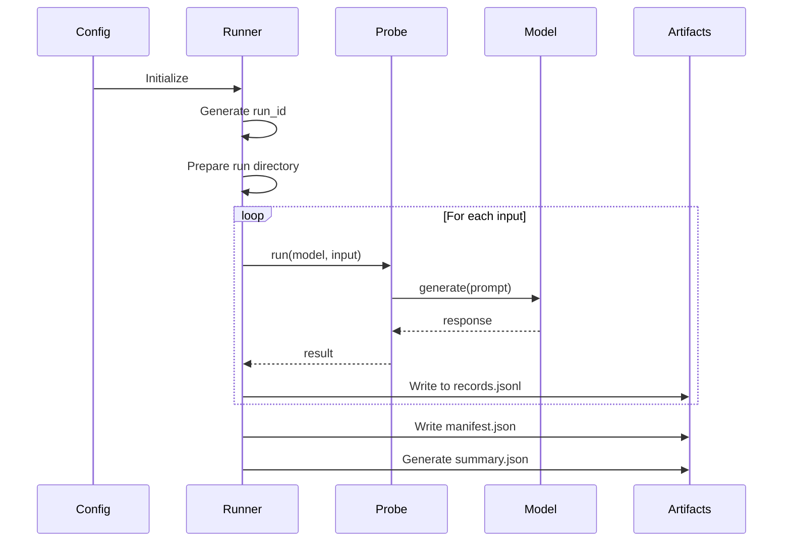

# Runners

Runners orchestrate probe execution and manage artifacts.

## Runner Types

| Runner | Execution | Best For |
|--------|-----------|----------|
| `ProbeRunner` | Sequential | Simple runs, debugging |
| `AsyncProbeRunner` | Concurrent | API-based models, large datasets |

## ProbeRunner

Synchronous, sequential execution:

```python
from insideLLMs.runtime.runner import ProbeRunner

runner = ProbeRunner(model, probe)
results = runner.run(prompt_set)

print(f"Success rate: {runner.success_rate:.1%}")
print(f"Errors: {runner.error_count}")
```

## AsyncProbeRunner

Concurrent execution with controlled parallelism:

```python
import asyncio
from insideLLMs.runtime.runner import AsyncProbeRunner

async def run_async():
    runner = AsyncProbeRunner(model, probe)
    results = await runner.run(
        prompt_set,
        concurrency=10  # Max parallel requests
    )
    return results

results = asyncio.run(run_async())
```

## Execution Flow



## Configuration

### Via RunConfig

```python
from insideLLMs.config_types import RunConfig

config = RunConfig(
    concurrency=10,
    emit_run_artifacts=True,
    run_root="./experiments",
    validate_output=True,
    return_experiment=True,
)

results = runner.run(prompt_set, config=config)
```

### Via Arguments

```python
results = runner.run(
    prompt_set,
    concurrency=10,
    emit_run_artifacts=True,
    run_dir="./my_run",
)
```

## Key Options

| Option | Type | Default | Description |
|--------|------|---------|-------------|
| `concurrency` | int | 1 | Max parallel requests |
| `emit_run_artifacts` | bool | False | Write records/manifest |
| `run_dir` | Path | Auto | Output directory |
| `run_root` | Path | `~/.insidellms/runs` | Root for runs |
| `overwrite` | bool | False | Overwrite existing run |
| `resume` | bool | False | Resume interrupted run |
| `validate_output` | bool | False | Validate against schema |
| `return_experiment` | bool | False | Return ExperimentResult |

## Progress Tracking

### Simple Callback

```python
def on_progress(current, total):
    print(f"\r{current}/{total}", end="")

results = runner.run(prompt_set, progress_callback=on_progress)
```

### Rich Callback

```python
from insideLLMs.config_types import ProgressInfo

def on_progress(info: ProgressInfo):
    eta = info.eta_seconds or 0
    print(f"\r{info.current}/{info.total} - ETA: {eta:.0f}s", end="")

results = runner.run(prompt_set, progress_callback=on_progress)
```

## Artifacts

When `emit_run_artifacts=True`:

```
run_dir/
├── records.jsonl      # One line per result
├── manifest.json      # Run metadata
├── config.resolved.yaml  # Full config
└── .insidellms_run    # Sentinel file
```

## Resume Capability

Resume interrupted runs:

```python
# First run (interrupted)
runner.run(prompt_set, run_dir="./my_run", emit_run_artifacts=True)
# ^C interrupts after 50/100

# Resume
runner.run(prompt_set, run_dir="./my_run", resume=True)
# Continues from record 51
```

## Runner Properties

After execution:

```python
runner.success_rate     # float: 0.0 - 1.0
runner.error_count      # int: number of errors
runner.last_run_id      # str: deterministic run ID
runner.last_run_dir     # Path: output directory
runner.last_experiment  # ExperimentResult: full results
```

## Convenience Functions

### run_probe

```python
from insideLLMs.runtime.runner import run_probe

results = run_probe(model, probe, prompt_set)
```

### run_probe_async

```python
from insideLLMs.runtime.runner import run_probe_async

results = await run_probe_async(
    model, probe, prompt_set,
    concurrency=10
)
```

### run_experiment_from_config

```python
from insideLLMs.runtime.runner import run_experiment_from_config

results = run_experiment_from_config("config.yaml")
```

### run_harness_from_config

```python
from insideLLMs.runtime.runner import run_harness_from_config

results = run_harness_from_config("harness.yaml")
```

## Error Handling

Errors are captured per-item, not raised:

```python
results = runner.run(prompt_set)

for result in results:
    if result["status"] == "error":
        print(f"Error: {result['error']}")
        print(f"Type: {result['error_type']}")
```

## See Also

- [Getting Started](../getting-started/index.md) - Basic usage
- [Configuration Reference](../reference/Configuration.md) - All options
- [Determinism](Determinism.md) - How run IDs work
