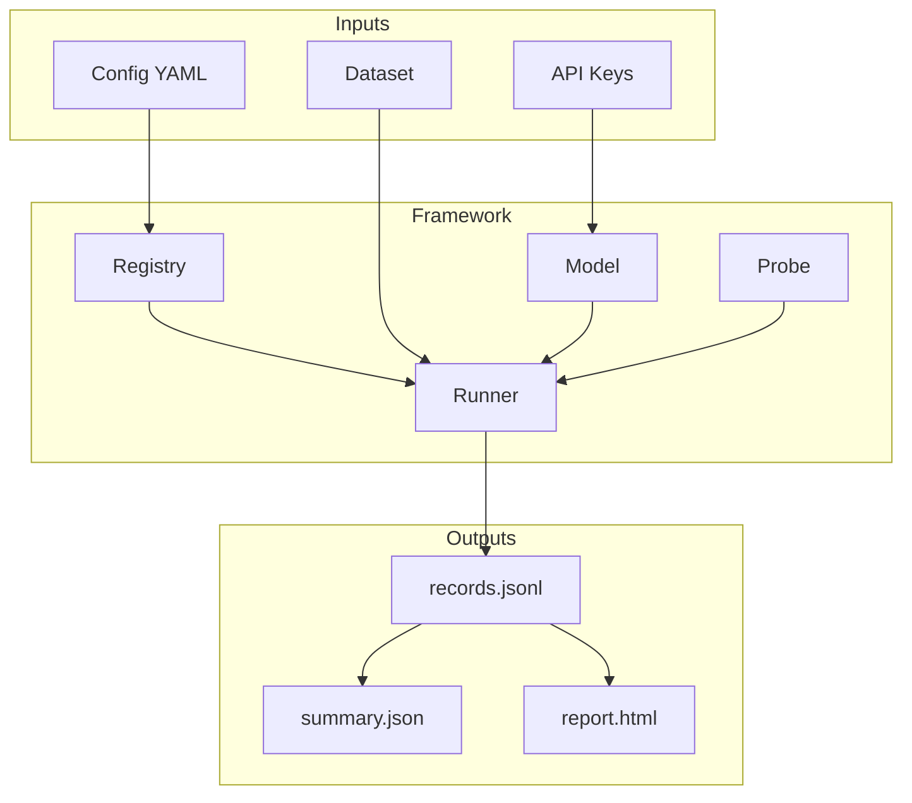

# Concepts

Deep dives into how insideLLMs works.

## Core Concepts

| Concept | Description |
|---------|-------------|
| [Models](Models.md) | Unified interface for LLM providers |
| [Probes](Probes.md) | Focused behavioural tests |
| [Runners](Runners.md) | Orchestration and execution |
| [Datasets](Datasets.md) | Input formats and loading |
| [Determinism](Determinism.md) | Reproducibility guarantees |
| [Artifacts](Artifacts.md) | Output files and schemas |

## How It All Fits Together



## Quick Concept Overview

### Models

All LLM providers (OpenAI, Anthropic, local) share a unified interface:

```python
model.generate("prompt")  # Text completion
model.chat([messages])    # Multi-turn conversation
model.info()              # Provider metadata
```

### Probes

Probes test specific behaviours:

```python
probe.run(model, input_data)  # Execute one test
probe.run_batch(model, dataset)  # Execute many
probe.score(results)  # Evaluate outcomes
```

### Runners

Runners orchestrate execution:

```python
runner = ProbeRunner(model, probe)
results = runner.run(dataset)
# or async:
results = await AsyncProbeRunner(model, probe).run(dataset, concurrency=10)
```

### Determinism

Same inputs → identical outputs:

- Run IDs are content hashes
- Timestamps derive from run ID
- Artifacts have stable formatting

This enables CI diff-gating.

## When to Read These

- **New to insideLLMs?** Start with [Getting Started](../getting-started/index.md) first
- **Building something?** Check [Tutorials](../tutorials/index.md) for hands-on guides
- **Need details?** Use [Reference](../reference/index.md) for complete API docs
- **Want to understand?** You're in the right place!
