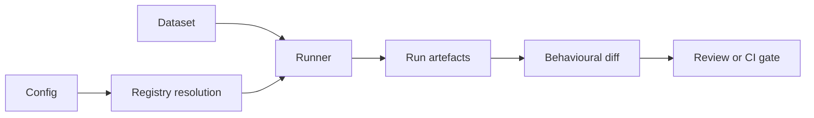

# Newcomer guide

This is the end-to-end orientation for insideLLMs 0.2.x, verified against version 0.2.0. It covers the product model,
installation, the first offline regression test, configuration, artefacts, providers, the
Python API, CI, security boundaries, extension points, and contributor workflow.

If you only do one thing, complete [the offline walkthrough](#run-the-offline-walkthrough).
It proves the core harness-to-diff path without an API key, model download, database, or
external service.

## Understand the project in one minute

insideLLMs is a behavioural regression harness for LLM-backed systems. It runs a stable set
of examples through one or more model/probe combinations, saves canonical records, and
compares an approved baseline with a candidate run. A CI job can then fail on a score
regression, selected output changes, trace drift, or agent/tool trajectory drift.



insideLLMs is most useful when you need to answer: **what changed for the exact prompts my
product cares about?** It is not a model host, training framework, or proof that one model is
universally better than another. The bundled benchmark datasets are small smoke fixtures,
not publishable model-quality evidence.

The central nouns are:

| Term | Meaning |
|---|---|
| Model | A provider or local adapter with a shared generation interface. |
| Probe | A behaviour-specific operation, such as logic, attack, or instruction following. |
| Dataset | Rows supplied to a probe. The required fields depend on that probe. |
| Run | One model and one probe over a dataset. |
| Harness | The Cartesian product of configured models and probes over one dataset. |
| Record | One canonical input/output result in `records.jsonl`. |
| Baseline | An intentionally reviewed, approved run directory. |
| Candidate | A new run compared with the baseline. |
| Gate | A diff policy that returns a non-zero process status in CI. |

## Choose the right entry point

| Goal | Use | Produces canonical run artefacts? |
|---|---|---|
| Check one prompt quickly | `insidellms quicktest` | No |
| Run one model and one probe | `insidellms run` | Yes |
| Run a model/probe matrix | `insidellms harness` | Yes |
| Compare approved and new behaviour | `insidellms diff` | Reads run artefacts |
| Rebuild a summary and HTML report | `insidellms report` | Adds derived artefacts |
| Exercise tiny built-in fixtures | `insidellms benchmark` | Separate smoke workflow |
| Embed evaluation in Python | `run_probe`, `ProbeRunner`, config runners | Optional |

Use the CLI for the first project and for CI. It is the shortest path to complete, diffable
run directories. Use the Python API when evaluation must be part of a larger application.

## Install insideLLMs

The package requires Python 3.10 or newer. The repository CI matrix covers Python 3.10–3.12;
newer interpreters may work but are outside that matrix.

### Install from reviewed source or a supplied wheel

Create an isolated environment in the directory where you want to try insideLLMs:

```bash
git clone https://github.com/dr-gareth-roberts/insideLLMs.git
cd insideLLMs
python3 -m venv .venv
source .venv/bin/activate
python3 -m pip install .
```

Release publication is not yet established. Use a reviewed source revision, or install
a supplied wheel after its package smoke test passes. Match the documentation to that revision.

If someone supplied a local wheel instead, install its actual path:

```bash
python3 -m pip install /path/to/insideLLMs-0.2.0-py3-none-any.whl
```

The command blocks in this guide use a POSIX shell. In Windows PowerShell, create the
environment with `py -m venv .venv`, activate it with `.venv\Scripts\Activate.ps1`, replace
`python3` with `py`, and inspect a command's process status with `$LASTEXITCODE` instead of
`$?`.

### Install from a source checkout

```bash
git clone https://github.com/dr-gareth-roberts/insideLLMs.git
cd insideLLMs
python3 -m venv .venv
source .venv/bin/activate
python3 -m pip install -e .
```

For contributor tools, install the development extra instead:

```bash
python3 -m pip install -e ".[dev]"
```

### Choose extras deliberately

The base dependencies are PyYAML and Pydantic. Install only the integrations you need:

| Extra | Adds |
|---|---|
| `openai` | OpenAI SDK; also supports the OpenRouter adapter. |
| `anthropic` | Anthropic SDK. |
| `huggingface` | Transformers and Hugging Face Hub, but not a PyTorch/TensorFlow backend. |
| `providers` | The three declared provider extras above, not every registered adapter. |
| `nlp` | NLTK, spaCy, scikit-learn, and gensim. |
| `visualization` | Matplotlib, Pillow, pandas, seaborn, and Jinja2. |
| `langchain` | LangChain, LangGraph, and the integration adapters. |
| `serving` | FastAPI and Uvicorn. |
| `crypto` | Cryptography support, including encrypted exports. |
| `signing` | The declared Python publishing dependency; `cosign` is still an external tool. |
| `dev` | pytest, Ruff, mypy, and contributor tooling. |
| `all` | All declared extras, but not every external service, CLI, or optional adapter SDK. |

Examples:

```bash
python3 -m pip install ".[openai]"
python3 -m pip install -e ".[dev,visualization]"
```

Gemini, Cohere, Ollama, llama.cpp, and vLLM have additional package or service requirements;
see [Use a real provider](#use-a-real-provider). Schema/config validation is included in the
base installation through its required Pydantic dependency.

### Verify the active environment

```bash
insidellms --version
insidellms doctor --capabilities
```

`doctor` is advisory by default. Warnings about providers, plotting libraries, model data, or
external tools do not mean the offline core is broken. Add `--fail-on-warn` only when your own
environment policy requires every recommended capability.

If the console script is not on `PATH`, use the supported module form:

```bash
python3 -m insideLLMs.cli --version
```

`python3 -m insideLLMs` is not supported because the package root has no `__main__.py`.

## Run the offline walkthrough

Run these commands from a fresh working directory after installation. The initializer is
available from both a wheel and a source checkout, so this walkthrough does not depend on the
repository's `ci/` directory.

### 1. Check one prompt

```bash
insidellms quicktest "What is 2 + 2?" --model dummy
```

`DummyModel` echoes or returns a canned response. It is for testing plumbing and determinism,
not answer quality.

### 2. Generate a complete harness project

```bash
insidellms init harness.yaml --template harness
```

The command creates both:

```text
harness.yaml
data/harness_dataset.jsonl
```

Keep the generated configuration in the current directory. The initializer creates sample
data relative to the process working directory, while execution resolves dataset paths
relative to the configuration file. Writing the config into a different subdirectory without
moving the data or editing its path will break that relationship.

The harness template deliberately uses `dummy`. For this template, `--model` and `--probe` do
not customize the generated matrix; edit the resulting YAML when you are ready.

### 3. Preview the work

```bash
insidellms harness harness.yaml --dry-run
```

The current template plans one model × four probes × three examples = 12 evaluations. A dry
run loads the configuration and dataset and reports the matrix size, but it cannot prove that
every dataset row has the semantic shape every probe expects.

### 4. Produce a proposed baseline and candidate run

```bash
insidellms harness harness.yaml --run-dir runs/proposed-baseline
insidellms harness harness.yaml --run-dir runs/candidate
```

Use explicit run directories while learning. Without `--run-dir`, insideLLMs writes below
`INSIDELLMS_RUN_ROOT` or `~/.insidellms/runs/<run_id>`.

### 5. Compare and gate

```bash
insidellms diff runs/proposed-baseline runs/candidate --fail-on-changes
echo $?
```

The two DummyModel runs are identical, so the command exits `0`. Plain `insidellms diff`
is informational and also exits `0` when it finds differences. A CI failure requires an
explicit gate flag such as `--fail-on-changes` or `--fail-on-regressions`.

### 6. Inspect, optionally validate, and approve

```bash
insidellms report runs/proposed-baseline
```

Open `runs/proposed-baseline/report.html` locally and inspect its records before treating the
directory as approved. A directory name does not make a baseline trustworthy; approval is a
human or organizational decision.

The base package includes configuration and artifact validation:

```bash
insidellms validate runs/proposed-baseline
```

The original onboarding audit verified 12 canonical records against schema 1.0.1.
New runs default to schema 1.0.2, which adds explicit behavioural scores to runner
items. Scored datasets supply `reference_answer` (or `reference`); successful
execution without a reference leaves accuracy unmeasured. See the
[scored diff example](../../examples/diff/README.md) for the dataset contract.
That schema contract version is independent of the insideLLMs package version.

To watch a deliberately changed candidate fail with exit `2`, source-checkout users can run:

```bash
python3 examples/demo_diff_pipeline.py
```

That offline demo creates temporary runs, exercises score and output-change gates, validates
the baseline, rebuilds the report, and cleans up its temporary files.

### Source-checkout shortcut

Contributors can run the repository fixture directly:

```bash
make golden-path
```

The target uses `ci/harness.yaml` and invokes `--overwrite` on the fixed
`.tmp/runs/baseline`/`.tmp/runs/candidate` directories. Inspect those paths first if they could
contain retained work. If the active `python3` is not the project environment, pass it explicitly,
for example `make golden-path PYTHON=.venv/bin/python`.

## Configure a run or harness

The execution CLI reads ordinary YAML/JSON dictionaries. A single run uses singular keys:

```yaml
model:
  type: dummy
  args: {}
probe:
  type: logic
  args: {}
dataset:
  format: jsonl
  path: data/questions.jsonl
```

A harness uses lists and evaluates every configured combination:

```yaml
models:
  - type: dummy
    args: {}
probes:
  - type: logic
    args: {}
  - type: instruction_following
    args: {}
dataset:
  format: jsonl
  path: data/questions.jsonl
max_examples: 20
```

Follow these rules:

- Resolve local CSV/JSONL paths from the config file's directory during execution.
- Give rows stable `example_id` values when possible; diff matching depends on stable identity.
- Match row fields to each probe. For example, logic commonly consumes `question`, attack
  consumes `prompt`, code/instruction probes consume task-like fields, and `BiasProbe` expects
  counterfactual prompt pairs rather than an arbitrary string.
- CSV and JSONL loaders currently materialize the file in memory. The Hugging Face dataset
  format requires the separate `datasets` package; pin a revision or explicit dataset hash when
  reproducible identity matters.
- Put generation call options in the documented top-level generation/probe-run configuration,
  not blindly into provider constructor arguments.
- Export provider credentials in the environment and omit `api_key` from YAML. `${NAME}` is
  expanded for filesystem paths, not general model-argument values, and resolved configs are
  persisted into the run directory.
- Use `harness --dry-run` to inspect matrix size before spending money.
- `input_field` is unsupported and rejected. Prepare rows with the fields each probe expects.
- `max_examples` caps the dataset for harnesses and single runs, including async runs.
  This limits examples, not total provider calls: a probe may make multiple calls per example.

`config_version: "1"` uses the `type`/`args`/`format` shape above. `init`, `validate`, and
runtime loading share `insideLLMs.config_schema.RuntimeConfiguration`; Pydantic validation is
always active. The public `insideLLMs.config.load_config` also accepts this format. Legacy
`provider`/`model_id`/`source` builders remain available and expose `to_runtime_config()` for
explicit conversion. Runtime loading warns on legacy files and rejects settings it cannot
honor. `insideLLMs.config_types.RunConfig` controls direct programmatic runner calls.

| If you are... | Choose |
|---|---|
| Writing `run`/`harness` YAML | Version 1 configuration; check with `validate` and preview harnesses with `--dry-run` |
| Configuring `run_probe`/`ProbeRunner` | `insideLLMs.config_types.RunConfig` |
| Building a typed configuration | `insideLLMs.config_schema.RuntimeConfiguration` |

See [Configuration](../reference/Configuration.md) for the runtime format and run
`insidellms <command> --help` for the current execution flags.

## Read a run directory correctly

The initial artefact set depends on the entry point:

| Path | Meaning | When present |
|---|---|---|
| `.insidellms_run` | Safety marker for a managed run directory. | Artifact-emitting runs |
| `config.resolved.yaml` | Effective reproducibility snapshot. | Config-driven run/harness |
| `records.jsonl` | Canonical input/output stream; one result per line. | Run and harness |
| `manifest.json` | Run ID, schema bindings, model/probe/dataset identity, and counts. | Run and harness |
| `results.jsonl` | Legacy alias of `records.jsonl`; do not build new integrations on it. | Harness compatibility path |
| `summary.json` | Aggregates rebuilt from canonical records. | Harness; or after `report` |
| `report.html` | Standalone human-readable report. | Harness unless `--skip-report`; or after `report` |
| `diff.json` | Machine-readable comparison. | Only when explicitly requested from `diff` |

Print a machine-readable diff to stdout with `--format json`, or write it explicitly:

```bash
insidellms diff BASELINE CANDIDATE --format json --output diff.json
```

`--output` alone does not create JSON; it must be paired with `--format json`. A gate flag may
still return non-zero after writing a valid report, while an earlier setup/read failure can exit
before a file is created.

Important interpretation details:

- `status: success` means execution completed. It does not automatically mean the answer was
  correct, safe, or high quality.
- A displayed `success_rate` may therefore be execution success unless the chosen probe/evaluator
  actually emitted meaningful scores.
- Canonical `latency_ms` is intentionally `null`; use telemetry/tracing for operational latency.
- Canonical timestamps are synthesized from deterministic IDs and are not wall-clock run time.
- Deterministic artefact controls are enabled by default. `strict_serialization` rejects values
  that cannot be serialized deterministically; `deterministic_artifacts` removes host-dependent
  manifest fields such as platform and Python version.
- `records.jsonl` stores prompts, inputs, and outputs. Treat run directories as potentially
  sensitive data.

These choices make the comparison surface stable. They do not make an external model API
deterministic. Identical bytes require identical inputs, configuration, and model responses.

The corresponding YAML and CLI controls are:

```yaml
determinism:
  strict_serialization: true
  deterministic_artifacts: true
```

```bash
insidellms harness harness.yaml \
  --strict-serialization \
  --deterministic-artifacts
```

Both flags also have `--no-...` forms. Keep the defaults for comparable CI artefacts unless you
have a specific compatibility need.

See [Understanding outputs](Understanding-Outputs.md),
[the artefact contract](https://github.com/dr-gareth-roberts/insideLLMs/blob/main/docs/ARTIFACT_CONTRACT.md), and
[the determinism contract](https://github.com/dr-gareth-roberts/insideLLMs/blob/main/docs/DETERMINISM.md).

## Build a trustworthy baseline workflow

1. Version the harness configuration and dataset.
2. Pin provider/model identifiers and generation settings as far as the provider allows.
3. Generate a proposed baseline and inspect its records and report.
4. Approve and store the baseline intentionally; do not silently replace it after every run.
5. Generate candidates with stable example/model/probe identity.
6. Run the gate that represents your policy.
7. Review and explain intentional changes before promoting a candidate.

Choose a gate deliberately:

| Flag | Failure | Exit |
|---|---|---:|
| no fail flag | Informational diff only | 0 unless setup fails |
| `--fail-on-regressions` | A measured score regresses | 2 |
| `--fail-on-changes` | Regression, neutral/other output change, or missing/new record; improvements alone do not fail | 2 |
| `--fail-on-any-difference` | Any reported difference, including improvements and trace/trajectory changes | 2 |
| `--fail-on-trace-violations` | Candidate trace violations increase | 3 |
| `--fail-on-trace-drift` | Trace fingerprints differ | 4 |
| `--fail-on-trajectory-drift` | Agent/tool step or argument trajectory differs | 5 |

Exit `1` includes malformed evidence and incomparable metrics under a regression gate.
Argument-parser usage errors can also exit `2`
before comparison, so read the diagnostic rather than interpreting the number alone. If several
enabled gates fire, precedence is `2`, then `3`, then `4`, then `5`; the JSON report still carries
the individual findings.

Score comparison is deliberately simple: the named numeric primary metric (or `scores.score`
fallback) is assumed to be higher-is-better and compared exactly, with no tolerance. Any decrease
is a regression. Incompatible or one-sided score metadata fails `--fail-on-regressions` with
exit `1`; a missing score cannot establish that the candidate passed. A declared primary metric
must contain a finite numeric value. A success-to-non-success status transition is a
regression. Stochastic provider output can make `--fail-on-changes` noisy; use stable sampling
settings, caching where appropriate, scored policies, and human review rather than pretending
provider behaviour is byte-stable.

By default, an item-level probe/provider exception becomes an `error` or `timeout` record and the
harness continues collecting results. `run` and `harness` then exit `1` if any item failed,
execution was incomplete, counts do not match, or there were no successful records. To stop
collecting at the first failure, configure:

```yaml
runner:
  stop_on_error: true
```

Fail-fast harness execution can abort before aggregate records and the manifest
are written. Leave `stop_on_error` false when collecting all item diagnostics matters.

Setup, model/probe construction, dataset, and artefact failures also exit `1`. The manifest's
`custom.health` records execution health separately from `run_completed`. The GitHub Action
checks persisted records and manifest counts before comparing either run, including when an
older baseline version returned a misleading successful process status.

If a diff reports zero common keys, inspect model, probe, and example identity before judging
behaviour. A renamed model or changed dataset can look like wholesale removal and addition.

### Choose the CI baseline model explicitly

There are two distinct workflows:

- **Approved artefact:** retrieve an immutable, reviewed run directory, create a candidate, and
  invoke `diff`. Use this when approval attaches to exact records.
- **Base revision:** run the harness from both the pull request's base commit and candidate commit.
  This answers “what did this code change?” but regenerates an ephemeral baseline.

The reusable GitHub Action implements the second model; it does not retrieve a previously approved
run. It installs and executes candidate repository code. Fork pull requests still run that code.
Use an unprivileged `pull_request` workflow with `contents: read` and checkout
`persist-credentials: false`, never
`pull_request_target` for untrusted candidate execution, and do not expose provider or repository
secrets to forked code. The supplied workflow retains the diff and both run directories so
failed runs can be diagnosed. Recognized configuration credentials are scrubbed, but prompts
and outputs can still contain sensitive data. A separate trusted `workflow_run` workflow validates
a small report and posts the sticky PR comment; it never checks out or executes candidate code.
Inline comment inputs on the composite action are deprecated and have no effect.

See [GitHub Action](https://github.com/dr-gareth-roberts/insideLLMs/blob/main/docs/GITHUB_ACTION.md) and
[CI integration](../tutorials/CI-Integration.md) after the local baseline workflow is clear.

## Use a real provider

Start with readiness rather than trial-and-error:

```bash
insidellms list models
insidellms doctor --capabilities
```

Registry names select adapters; provider-specific `model_name` values belong in `args` and can
change independently of insideLLMs.

| Adapter | Requirement |
|---|---|
| `openai` | Install `[openai]`; export `OPENAI_API_KEY`. |
| `openrouter` | Install `[openai]`; export `OPENROUTER_API_KEY`. |
| `anthropic` | Install `[anthropic]`; export `ANTHROPIC_API_KEY`. |
| `gemini` | Install `google-generativeai` manually; export `GOOGLE_API_KEY`. |
| `cohere` | Install `cohere` manually; export `CO_API_KEY` or `COHERE_API_KEY`. |
| `huggingface` | Install `[huggingface]` plus a supported compute backend; expect model download/cache. |
| `llamacpp` | Install `llama-cpp-python` and supply a local GGUF model path. |
| `ollama` | Install/reach Ollama; local use needs its service, cloud use may use `OLLAMA_API_KEY`. |
| `vllm` | Reach an OpenAI-compatible vLLM server; the client path needs the OpenAI SDK. |

Here is a bounded OpenAI smoke call. Replace the placeholder with a model ID that your account
currently supports:

```bash
python3 -m pip install "insidellms[openai]"
# Load OPENAI_API_KEY through direnv or your secret manager first. The `&&`
# prevents the paid call when the variable is absent.
test -n "${OPENAI_API_KEY:-}" && insidellms quicktest "Reply only with OK." \
  --model openai \
  --model-args '{"model_name":"YOUR_PROVIDER_MODEL_ID","max_retries":0}' \
  --temperature 0 \
  --max-tokens 8
```

Do not add `--probe` to this readiness call: doing so invokes the probe after the initial
generation and can make another paid request. Then save the following as `live-harness.yaml` in
the same directory as the generated `harness.yaml`/`data/` pair. It reduces the live run to one
example and one probe:

```yaml
models:
  - type: openai
    args:
      model_name: YOUR_PROVIDER_MODEL_ID
      timeout: 30
      max_retries: 0
probes:
  - type: logic
dataset:
  format: jsonl
  path: data/harness_dataset.jsonl
max_examples: 1
generation:
  temperature: 0
  max_tokens: 64
```

```bash
insidellms harness live-harness.yaml --dry-run
insidellms harness live-harness.yaml --run-dir runs/live-smoke
```

The harness has no integrated hard monetary cap. `max_examples`, output-token limits, retry
limits, and small matrices reduce exposure; cost middleware estimates spend only after calls.
Enforce actual ceilings with provider-side budgets/quotas.

Prefer a `.envrc` loaded by direnv or your deployment's secret manager; do not type a literal key
as a command argument. To use direnv, first ensure `.envrc` is ignored, create it in an editor with
`export OPENAI_API_KEY="<secret>"`, run `direnv allow`, and keep the file local. In a Git repository,
verify the rule with `git check-ignore .envrc`; this repository's `.gitignore` includes it. A
standalone, non-Git demo directory has no commit risk but the file is still sensitive. insideLLMs
does not automatically load a `.env` file. Never commit credentials or put them in resolved YAML.
Lock provider SDK versions in deployed environments. Provider-specific identifiers in examples
can age; check the provider before spending money on a large harness.

Treat `doctor` as a useful presence/configuration diagnostic, not runtime proof. Its capability
matrix cannot prove that a credential, endpoint, local service, or selected model is usable; run
the bounded smoke call through the adapter you intend to use.

See [Provider setup](../guides/Provider-Setup.md) and
[Models catalog](../reference/Models-Catalog.md) for adapter details.

## Use the Python API

This minimal example is offline and avoids writing to the default run root:

```python
from insideLLMs.config_types import RunConfig
from insideLLMs.models import DummyModel
from insideLLMs.probes import LogicProbe
from insideLLMs.runtime.runner import run_probe

results = run_probe(
    DummyModel(canned_response="4"),
    LogicProbe(),
    ["What is 2 + 2?"],
    config=RunConfig(emit_run_artifacts=False),
)

print(results[0]["output"])
```

Key programmatic paths are:

| Need | API | Stability |
|---|---|---|
| One model/probe in memory | `insideLLMs.runtime.runner.run_probe` or `ProbeRunner` | Stable runtime surface |
| One config-driven experiment | `insideLLMs.runtime.runner.run_experiment_from_config` | Stable runtime surface |
| In-memory model/probe matrix | `insideLLMs.runtime.runner.run_harness_from_config` | Stable runtime surface |
| Async strategy-oriented generation | `InferenceClient` | Evolving inference surface |
| Custom resource lookup | `model_registry`, `probe_registry`, `dataset_registry` | Stable extension surface |

`run_harness_from_config` returns an in-memory dictionary; the CLI adds the complete harness
directory, summary, report, and compatibility alias. Prefer the CLI when artefact lifecycle and
gate exit codes are the main goal.

To extend the system:

- Subclass `insideLLMs.models.base.Model` for a provider adapter.
- Subclass `insideLLMs.probes.base.Probe` for a behaviour operation.
- Use `ScoredProbe` when you have an explicit ground-truth evaluation step.
- Register factories, not instances, with the registries.
- Package reusable extensions through the `insidellms.plugins` entry-point group.

Start with the runnable [registry example](https://github.com/dr-gareth-roberts/insideLLMs/blob/main/examples/example_registry.py) and the
[plugin packaging contract](https://github.com/dr-gareth-roberts/insideLLMs/blob/main/docs/PLUGINS.md) for method signatures, entry-point metadata,
and tests.

Test scoring all the way through saved records. Supply a held-out `reference_answer` (or
`reference`) for a `ScoredProbe`. The runtime calls `evaluate_single` and persists normalized
scores while retaining raw output. Omit the field to leave the item unscored, or set it explicitly
to null for a reference-free evaluator. Missing references do not imply 100% accuracy.

Custom dataset registry entries are currently programmatic. Runtime YAML still recognizes only
the built-in CSV, JSONL, Hugging Face, and inline formats.

Installed plugin registration functions execute arbitrary Python during registry initialization
and can access the process environment, including provider credentials. Install only trusted
plugins. For controlled CI, set `INSIDELLMS_DISABLE_PLUGINS=1` before importing or invoking
insideLLMs unless the job explicitly requires reviewed plugins.

Use canonical import paths from [Import paths](https://github.com/dr-gareth-roberts/insideLLMs/blob/main/docs/IMPORT_PATHS.md), and avoid importing
from underscored modules such as `insideLLMs.runtime._*` or `insideLLMs.cli._*`.

## Navigate the CLI

The 22 commands are easier to understand in groups:

| Group | Commands |
|---|---|
| Onboarding/discovery | `welcome`, `doctor`, `list`, `info`, `init` |
| Fast exploration | `quicktest`, `interactive`, `compare`, `benchmark`, `generate-suite`, `optimize-prompt` |
| Artefact lifecycle | `run`, `harness`, `report`, `validate`, `diff`, `trend`, `export` |
| Contracts | `schema` |
| Advanced provenance | `attest`, `sign`, `verify-signatures` |

Run `insidellms <command> --help` for the live parser. A few distinctions matter early:

- `run` supports resume, async execution, concurrency, timeout, and stop-on-error controls.
- `harness` supports matrix planning (`--dry-run`), reports, profiles, and red-team overlays,
  but it does not share every `run` option.
- `report` rebuilds the report in the run directory; it does not currently accept an arbitrary
  output/template flag pair.
- `compare --models` expects adapter registry names such as `openai,anthropic`, not provider
  model IDs.
- `compare` is an exploratory command and provider failures may not make it exit non-zero. Use
  `harness` plus `diff` for an enforceable CI policy.
- `benchmark` defaults to DummyModel/logic and its 87 bundled examples are smoke fixtures.
- Use `list datasets --detailed` for bundled dataset details and `info dataset <name>`
  for individual dataset statistics and samples.
- JSON-oriented commands keep the machine payload on stdout and status messages on stderr.
- Interactive mode persists raw input to `.insidellms_history` by default; treat that file as
  sensitive.

See the [CLI reference](../reference/CLI.md) for the full command surface.

## Know what is stable and what is evolving

The project explicitly tiers its public surface:

| Tier | Prefer for | Examples |
|---|---|---|
| Stable | CI and long-lived integrations | Core `run`/`harness`/`report`/`diff`, schemas, canonical artefacts, runtime runners, registries, base model/probe interfaces |
| Evolving | Feature work with planned migration notes | Analysis/export helpers, broad root conveniences, inference strategies, observability, HITL, steering |
| Internal | Repository implementation only | Underscored runtime/CLI modules and undocumented helpers |

The deterministic run/diff spine is the product core. The repository also contains substantial
optional systems:

- `InferenceClient` for one-shot, self-consistency, and verifier-selected generation with a
  shared result/spend/provenance envelope.
- Runtime middleware for trace, cache, rate limiting, retries, and cost tracking.
- Analysis, statistics, visualization, export, and matched-compute evaluation.
- Production shadow capture for converting sampled traffic into replayable records.
- Experiment tracking backends and trace-aware drift gates.
- Privacy helpers for redaction, encryption, and selective disclosure.
- Provenance tooling for DSSE, cosign, transparency receipts, policy, and OCI publishing.

Read [API tiers](https://github.com/dr-gareth-roberts/insideLLMs/blob/main/docs/architecture/API_TIERS.md),
[Stability](https://github.com/dr-gareth-roberts/insideLLMs/blob/main/docs/STABILITY.md), and the
[Stability matrix](https://github.com/dr-gareth-roberts/insideLLMs/blob/main/docs/STABILITY_MATRIX.md) before coupling to advanced surfaces.

### Provenance trust boundaries

The advanced trust chain has explicit limits in the current code:

- `insidellms attest` creates DSSE envelopes with no embedded signatures. Treat them as drafts
  until detached cosign bundles are produced and verified.
- `insidellms verify-signatures` checks each DSSE file it finds against its corresponding detached
  cosign bundle and fails when that bundle is missing. It does not require the complete expected
  attestation set. Optional `--identity` adds one certificate-identity constraint, but the command
  does not enforce an issuer, organization allowlist, run-policy decision, or signer authorization.
- SCITT receipt checking is structural completeness checking, not cryptographic receipt or
  inclusion-proof verification.
- The TUF dataset client has no real verification path. It fails closed unless a test explicitly
  opts into a mock result labelled `verified=False`.

Do not describe an unsigned attestation, structurally checked receipt, or test mock as verified
supply-chain evidence. See [Verifiable evaluation](../advanced/Verifiable-Evaluation.md).

## Protect data, secrets, and budget

- Assume `records.jsonl`, reports, traces, and interactive history contain the original prompt
  and model output.
- Keep keys in environment/secret management and out of YAML, logs, shell history, and version
  control.
- Review run artefacts before committing or uploading them.
- `export --redact-pii` sanitizes the exported copy, not the source run. Pattern-based PII
  detection has false positives and false negatives and is not a compliance solution.
- Encryption requires the crypto dependency and sound external key management.
- Start with small matrices, output-token/retry limits, and provider-side budgets; async
  concurrency can multiply rate and cost quickly, and insideLLMs has no integrated monetary cap.
- In CI, use least-privilege permissions, keep secrets away from untrusted pull-request code,
  decide retention/deletion before uploading artefacts, and avoid raw-run uploads unless access
  controls match the data sensitivity.
- Do not interpret a clean schema validation as evidence of factuality, safety, compliance, or
  signer identity. It only proves the checked data contract.

See [PII detection](https://github.com/dr-gareth-roberts/insideLLMs/blob/main/docs/PII_DETECTION.md) and the
[Security policy](https://github.com/dr-gareth-roberts/insideLLMs/blob/main/SECURITY.md).

## Troubleshoot common first-run failures

| Symptom | What to check |
|---|---|
| `insidellms: command not found` | Activate the intended virtualenv or use `python3 -m insideLLMs.cli`. |
| `No module named yaml` | You are running from source with an uninstalled Python; install the package in that interpreter. |
| `No module named insideLLMs.__main__` | Use `python3 -m insideLLMs.cli`, not `python3 -m insideLLMs`. |
| `doctor` shows warnings | Determine whether the missing item is optional for your chosen path. |
| Run directory already exists | Use a new directory, resume a compatible single run, or deliberately use `--overwrite`. |
| Dataset not found | Check the path relative to the config file and the `init` working-directory caveat. |
| `validate harness.yaml` reports missing `model`/`probe` | Current config validation understands the singular run shape; use `harness --dry-run`, then validate the produced run directory. |
| Diff shows changes but exits 0 | Add the gate flag that represents your policy. |
| Diff shows no common records | Check model/probe/example identity between runs. |
| Probe rejects a dataset row | Read that probe's input contract; probes do not all accept the same row shape. |
| Report is absent | The harness used `--skip-report`, or this was a single run; run `insidellms report <run-dir>`. |
| Provider is listed but not ready | `list` shows registrations; `doctor --capabilities` checks dependency/key presence and describes service requirements, but does not validate live access. |

`--overwrite` is intentionally labelled dangerous. Prefer a new candidate directory until you
have confirmed the exact path. Interactive diff mode can also accept candidate artefacts as a
new baseline; use that only as an explicit review action.

## Tour the source repository

| Path | Responsibility |
|---|---|
| `insideLLMs/models/` | Provider and local model adapters. |
| `insideLLMs/probes/` | Built-in behavioural probe contracts and implementations. |
| `insideLLMs/runtime/` | Runners, deterministic artefacts, middleware, diffing, and workflow helpers. |
| `insideLLMs/analysis/` | Evaluation, comparison, statistics, export, and visualization. |
| `insideLLMs/inference/` | Strategy-oriented async inference and auditable result envelopes. |
| `insideLLMs/schemas/` | Versioned serialized-output contracts. |
| `insideLLMs/attestations/`, `insideLLMs/crypto/`, `insideLLMs/signing/`, `insideLLMs/policy/` | Optional provenance and policy stack. |
| `insideLLMs/contrib/` | Broad, mostly optional research and feature modules; not the core run/diff spine. |
| `tests/` | Behaviour, contract, determinism, adapter, and optional integration tests. |
| `examples/` | Runnable workflows; start with the diff demo and programmatic harness. |
| `ci/` | Offline source-checkout harness and dataset. |
| `wiki/` | User-facing documentation site source. |
| `docs/` | Contracts, architecture notes, policies, and contributor deep dives. |
| `extensions/vscode-insidellms/` | VS Code/Cursor extension source scaffold; build it before use. |
| `compliance_intelligence/` | Standalone LangGraph/FastAPI demonstration, not part of core insideLLMs execution. |

In a source checkout, start repository exploration with the root `codemap.md`, then read the codemap in
the specific package you are changing. The concise architecture companion is
[ARCHITECTURE.md](https://github.com/dr-gareth-roberts/insideLLMs/blob/main/ARCHITECTURE.md).

## Contribute safely

The Makefile workflow assumes GNU Make and a POSIX-like shell. On Windows, use WSL. Without Make,
the core `make check` equivalents are `python3 -m ruff check .`,
`python3 -m ruff format --check .`, `python3 -m mypy insideLLMs`, and
`python3 -m pytest`; run the additional golden-path and documentation commands separately.

```bash
python3 -m venv .venv
source .venv/bin/activate
python3 -m pip install -e ".[dev]"

make check-fast
make check
make golden-path
make docs-audit
```

| Command | Purpose |
|---|---|
| `make check-fast` | Ruff lint, format check, and non-slow/non-integration tests. |
| `make check` | Lint, format check, mypy, and the full test suite. |
| `make golden-path` | Offline deterministic harness/diff proof. |
| `make docs-audit` | CLI/model/probe documentation parity plus wiki-link checks. |
| `make test-determinism` | Tests marked for deterministic guarantees. |
| `make test-contract` | Public compatibility contract tests. |

The CI workflow runs lint/format, mypy, tests on Python 3.10–3.12, a golden-path job, and
stability-contract tests. Optional dependencies can legitimately cause skips in narrower
environments; use `doctor` and the relevant focused tests to distinguish a skip from proof that
an integration works.

For provider-adapter work, install both development and adapter extras, then run that adapter's
mock-boundary tests before any explicitly authorized live test. For example:

```bash
python3 -m pip install -e ".[dev,openai]"
python3 -m pytest tests/test_models_openai.py tests/test_models_openai_gateway.py
```

`make check` already runs the full test suite, including marked contract and determinism tests.
Use `make test-contract` and `make test-determinism` as faster focused evidence while changing a
stable surface, then run the full gate before handoff.

The current wiki-link script checks top-level `wiki/*.md` files only. Nested guides still need a
direct link/content review even when `make docs-audit` passes.

Read [CONTRIBUTING.md](https://github.com/dr-gareth-roberts/insideLLMs/blob/main/CONTRIBUTING.md) before changing public behavior. When changing a
stable CLI, schema, artefact, or registry surface, update compatibility tests, the changelog,
and migration documentation together.

## Decide what to read next

| If you want to... | Read/run |
|---|---|
| Learn the shorter staged path | [Getting started](index.md) |
| Understand the exact CLI | [CLI reference](../reference/CLI.md) and live `--help` |
| Build runtime YAML | [Configuration](../reference/Configuration.md) |
| Select a model or probe | [Models catalog](../reference/Models-Catalog.md), [Probes catalog](../reference/Probes-Catalog.md) |
| Understand canonical files | [Artefact contract](https://github.com/dr-gareth-roberts/insideLLMs/blob/main/docs/ARTIFACT_CONTRACT.md), [Determinism](https://github.com/dr-gareth-roberts/insideLLMs/blob/main/docs/DETERMINISM.md) |
| Add CI gating | [CI integration](../tutorials/CI-Integration.md), [GitHub Action](https://github.com/dr-gareth-roberts/insideLLMs/blob/main/docs/GITHUB_ACTION.md) |
| Extend via registries/plugins | [Plugins](https://github.com/dr-gareth-roberts/insideLLMs/blob/main/docs/PLUGINS.md), [registry example](https://github.com/dr-gareth-roberts/insideLLMs/blob/main/examples/example_registry.py) |
| Use reliable inference strategies | [Inference strategies](https://github.com/dr-gareth-roberts/insideLLMs/blob/main/docs/INFERENCE_STRATEGIES.md) |
| Understand the whole codebase | Source-checkout `codemap.md`, [Architecture](https://github.com/dr-gareth-roberts/insideLLMs/blob/main/ARCHITECTURE.md) |
| Find every documentation surface | [Documentation index](https://github.com/dr-gareth-roberts/insideLLMs/blob/main/DOCUMENTATION_INDEX.md) |

The project is broad, but the adoption path should stay narrow: prove the offline
harness/diff spine, replace DummyModel with one real adapter, curate a product-specific dataset,
then add scoring, CI policy, and advanced subsystems only when each solves a concrete need.
