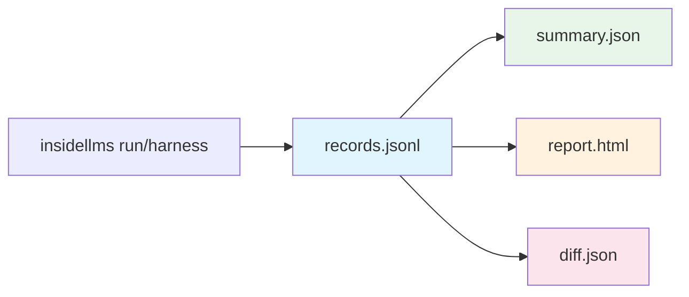

# Understanding Outputs

insideLLMs produces deterministic artifacts designed for reproducibility and CI integration.

## Output Overview



| Artifact | Purpose | Format |
|----------|---------|--------|
| `records.jsonl` | Raw results, one per line | JSON Lines |
| `manifest.json` | Run metadata | JSON |
| `config.resolved.yaml` | Full resolved config | YAML |
| `summary.json` | Aggregated metrics | JSON |
| `report.html` | Human-readable report | HTML |
| `diff.json` | Comparison between runs | JSON |

## records.jsonl

The canonical output. Every example produces one JSON line:

```json
{
  "schema_version": "1.0.0",
  "run_id": "a1b2c3d4e5f6...",
  "started_at": "2009-03-14T15:09:26.535897+00:00",
  "completed_at": "2009-03-14T15:09:26.535898+00:00",
  "model": {
    "model_id": "gpt-4o",
    "provider": "openai"
  },
  "probe": {
    "probe_id": "logic"
  },
  "dataset": {
    "dataset_id": "questions.jsonl"
  },
  "example_id": "0",
  "input": {
    "question": "What is 2 + 2?",
    "expected": "4"
  },
  "output": "The answer is 4.",
  "status": "success",
  "error": null
}
```

### Key Fields

| Field | Description |
|-------|-------------|
| `run_id` | Deterministic hash of inputs (same inputs = same ID) |
| `started_at` | Deterministic timestamp (derived from run_id) |
| `example_id` | Index or ID from the input dataset |
| `input` | The original input item |
| `output` | Model's response |
| `status` | `"success"` or `"error"` |
| `error` | Error message if status is error |

## manifest.json

Metadata about the run:

```json
{
  "schema_version": "1.0.0",
  "run_id": "a1b2c3d4e5f6...",
  "created_at": "2009-03-14T15:09:26.535897+00:00",
  "started_at": "2009-03-14T15:09:26.535897+00:00",
  "completed_at": "2009-03-14T15:09:26.535899+00:00",
  "library_version": "0.1.0",
  "python_version": "3.11.0",
  "platform": "macOS-14.0-arm64",
  "model": {"model_id": "gpt-4o", "provider": "openai"},
  "probe": {"probe_id": "logic"},
  "dataset": {"dataset_id": "questions.jsonl"},
  "record_count": 100,
  "success_count": 98,
  "error_count": 2
}
```

## summary.json

Aggregated statistics:

```json
{
  "schema_version": "1.0.0",
  "run_id": "a1b2c3d4e5f6...",
  "models": {
    "gpt-4o": {
      "success_rate": 0.98,
      "example_count": 100,
      "error_count": 2,
      "metrics": {
        "accuracy": 0.95,
        "confidence_interval": [0.92, 0.98]
      }
    }
  },
  "probes": {
    "logic": {
      "success_rate": 0.98
    }
  }
}
```

## report.html

A standalone HTML file for human review:

- Model comparison tables
- Success/failure breakdown
- Individual response inspection
- Filterable and searchable

Open in any browser - no server required.

## diff.json

Compare two runs with `insidellms diff`:

```bash
insidellms diff baseline_run/ candidate_run/
```

```json
{
  "baseline_run_id": "abc123...",
  "candidate_run_id": "def456...",
  "changes": [
    {
      "example_id": "42",
      "field": "output",
      "baseline": "The answer is 4",
      "candidate": "The answer is four"
    }
  ],
  "summary": {
    "total_examples": 100,
    "changed": 3,
    "unchanged": 97
  }
}
```

Use `--fail-on-changes` for CI gating:

```bash
insidellms diff baseline/ candidate/ --fail-on-changes
# Exit code 1 if any changes detected
```

## Determinism Guarantees

insideLLMs ensures identical inputs produce identical outputs:

| What | How |
|------|-----|
| `run_id` | SHA-256 hash of config + dataset |
| Timestamps | Derived from run_id (not wall-clock) |
| Record order | Matches input dataset order |
| JSON formatting | Stable key ordering, consistent separators |

This enables:
- **CI diff-gating**: Detect behavioral regressions
- **Reproducibility**: Re-run and get identical artifacts
- **Caching**: Skip already-computed results

## What's Next?

Now that you understand the outputs, explore:

- [Determinism and CI](../Determinism-and-CI.md) - How determinism enables CI integration
- [CI Integration Tutorial](../tutorials/CI-Integration.md) - Set up diff-gating in GitHub Actions
- [Tracing and Fingerprinting](../Tracing-and-Fingerprinting.md) - Advanced diff features
