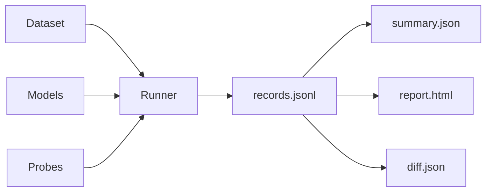

# insideLLMs

**Deterministic behavioral testing for LLMs.** Compare models, detect regressions, gate your CI.



---

## Start Here

Choose your path based on what you want to do:

| I want to... | Start here | Time |
|--------------|------------|------|
| **Try it out** | [Quick Install](getting-started/Quick-Install.md) | 5 min |
| **Evaluate a model** | [First Harness](getting-started/First-Harness.md) | 15 min |
| **Detect bias** | [Bias Testing Tutorial](tutorials/Bias-Testing.md) | 20 min |
| **Compare models** | [Model Comparison Tutorial](tutorials/Model-Comparison.md) | 20 min |
| **Add to CI** | [CI Integration Tutorial](tutorials/CI-Integration.md) | 30 min |

---

## What insideLLMs Does

### Unified Model Interface
Run the same tests across OpenAI, Anthropic, local models (Ollama, llama.cpp), and more.

### Behavioral Probes
Test for logic, bias, safety, factuality, code generation, and instruction following.

### Deterministic Outputs
Same inputs always produce identical artifacts — perfect for CI diff-gating.

### Rich Comparison Reports
HTML reports, JSON summaries, and machine-readable diffs.

---

## Quick Example

```bash
# Install
pip install -e ".[all]"

# Quick test (no API keys needed)
insidellms quicktest "What is 2 + 2?" --model dummy

# Run a comparison harness
insidellms harness examples/harness.yaml --run-dir ./results

# Diff two runs for CI gating
insidellms diff ./baseline ./candidate --fail-on-changes
```

---

## Documentation Sections

| Section | Description |
|---------|-------------|
| [Getting Started](getting-started/index.md) | Install and run your first test |
| [Tutorials](tutorials/index.md) | Step-by-step guides for common tasks |
| [Concepts](concepts/index.md) | Deep dives into how things work |
| [Reference](reference/index.md) | Complete CLI and API documentation |
| [Guides](guides/index.md) | How-tos for specific integrations |

---

## Core Concepts at a Glance

| Concept | What it is |
|---------|------------|
| **Models** | Unified interface for all LLM providers |
| **Probes** | Focused tests for specific behaviors |
| **Harness** | Run probes across models and datasets |
| **Artifacts** | Deterministic outputs: records, summary, report, diff |
| **Determinism** | Same inputs → identical outputs (for CI) |

---

## Community

- [GitHub Repository](https://github.com/dr-gareth-roberts/insideLLMs)
- [Report an Issue](https://github.com/dr-gareth-roberts/insideLLMs/issues)
- [Contributing Guide](CONTRIBUTING.md)
