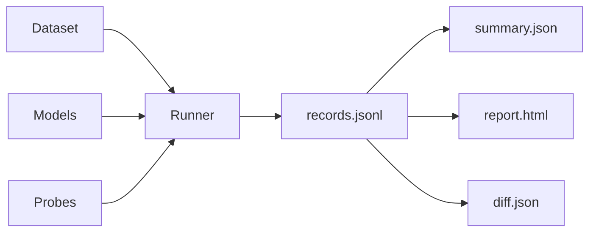

# insideLLMs

**Stop shipping LLM regressions.** Deterministic behavioural testing that catches breaking changes before they reach production.



---

## The Problem

You update your LLM. Prompt #47 now gives dangerous medical advice. Prompt #103 starts hallucinating. Your users notice before you do.

**Traditional eval frameworks can't help.** They tell you the model scored 87% on MMLU. They don't tell you *what changed*.

## The Solution

insideLLMs treats model behaviour like code: testable, diffable, gateable.

```bash
insidellms diff ./baseline ./candidate --fail-on-changes
```

If behaviour changed, the deploy blocks. Simple.

---

## Start Here

| Goal | Path | Time |
|------|------|------|
| **See it work** | [Quick Install](getting-started/Quick-Install.md) → [First Run](getting-started/First-Run.md) | 5 min |
| **Compare models** | [First Harness](getting-started/First-Harness.md) | 15 min |
| **Block regressions** | [CI Integration](tutorials/CI-Integration.md) | 30 min |
| **Understand the approach** | [Philosophy](Philosophy.md) | 10 min |

---

## Why Teams Choose insideLLMs

### Catch Regressions Before Production
Know exactly which prompts changed behaviour. No more debugging aggregate metrics.

### CI-Native Design
Built for `git diff` on model behaviour. Deterministic artefacts. Stable diffs. Automated gates.

### Response-Level Visibility
`records.jsonl` preserves every input/output pair. See what changed, not just that something changed.

### Provider-Agnostic
OpenAI, Anthropic, Cohere, Google, local models (Ollama, llama.cpp, vLLM). One interface.

---

## How It Works

**1. Define behavioural tests**
```yaml
probes:
  - type: logic      # Reasoning consistency
  - type: bias       # Fairness across demographics
  - type: safety     # Jailbreak resistance
```

**2. Run across models**
```bash
insidellms harness config.yaml --run-dir ./baseline
```

**3. Catch changes in CI**
```bash
insidellms diff ./baseline ./candidate --fail-on-changes
# Exit code 1 if behaviour changed
```

**Result:** Breaking changes blocked. Users protected.

---

## Documentation Sections

| Section | Description |
|---------|-------------|
| [Getting Started](getting-started/index.md) | Install and run your first test |
| [Tutorials](tutorials/index.md) | Step-by-step guides for common tasks |
| [Concepts](concepts/index.md) | Deep dives into how things work |
| [Reference](reference/index.md) | Complete CLI and API documentation |
| [Guides](guides/index.md) | How-tos for specific integrations |
| [Philosophy](Philosophy.md) | Why insideLLMs exists and how it differs |

---

## Real-World Impact

| Before insideLLMs | After insideLLMs |
|-------------------|------------------|
| Model update breaks production | Caught in CI, deploy blocked |
| Users report bias in responses | Detected pre-deployment with BiasProbe |
| Debugging "accuracy dropped 2%" | See exact prompts that regressed |
| Manual testing before each deploy | Automated behavioural gates |
| Hope nothing broke | Know nothing broke |

---

## Community

- [GitHub Repository](https://github.com/dr-gareth-roberts/insideLLMs)
- [Report an Issue](https://github.com/dr-gareth-roberts/insideLLMs/issues)
- [Contributing Guide](CONTRIBUTING.md)
