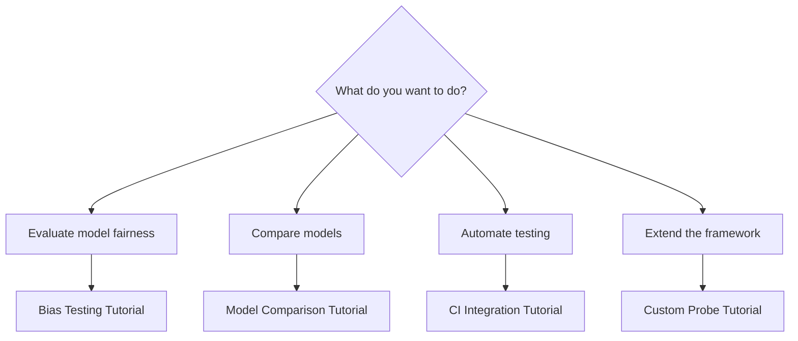

# Tutorials

Step-by-step guides for common tasks. Each tutorial takes 15-30 minutes.

## Available Tutorials

| Tutorial | What You'll Build | Prerequisites |
|----------|-------------------|---------------|
| [Bias Testing](Bias-Testing.md) | Detect bias across model responses | [First Run](../getting-started/First-Run.md) |
| [Model Comparison](Model-Comparison.md) | Compare GPT-4 vs Claude systematically | API keys |
| [CI Integration](CI-Integration.md) | Add diff-gating to GitHub Actions | Git basics |
| [Custom Probe](Custom-Probe.md) | Build your own evaluation probe | Python basics |

## Tutorial Format

Each tutorial follows the same structure:

1. **Goal** - What you'll accomplish
2. **Prerequisites** - What you need before starting
3. **Steps** - Numbered instructions with code
4. **Verification** - How to confirm it worked
5. **Next Steps** - Where to go from here

## Choosing Your Tutorial

## Before You Start

Make sure you've completed [Getting Started](../getting-started/index.md):

- insideLLMs installed
- First run completed
- Understand basic concepts (models, probes, harness)
